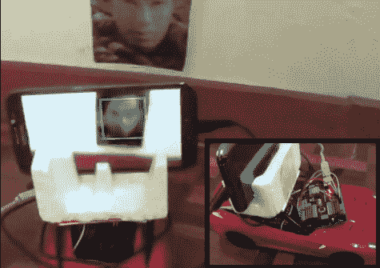

# Android+Arduino–面部跟随遥控汽车

> 原文：<https://hackaday.com/2014/01/15/androidarduino-face-following-rc-car/>

对我们中的一些人来说，黑掉一辆遥控汽车来简单地跟随黑线或避开障碍物太容易了，我们确信[Shazin]会同意这一点，因为他创造了一辆跟随你的脸的[遥控汽车！](http://shazsterblog.blogspot.com/2014/01/face-following-rc-car-using-android.html)

这个项目的第一步是控制遥控汽车，但[Shazin]决定直接控制汽车，而不是劫持发射器。这不是任何高端遥控汽车，所以忘了 PWM 控制。相反，我们发现单个 IC ( [RX-2](http://shazsterblog.blogspot.com/2013/04/rc-car-tear-down-and-control-using.html) )可以同时处理 RF 接收器和 H 桥。经过一番探查，4 条控制线(前/后和左/右)被识别出来并连接到一个 Arduino。

[Shazin]将 Arduino 与 USB 主机屏蔽配对，并通过 [ADB](http://hackaday.com/2012/04/06/a-simple-project-to-get-you-started-with-the-android-adk/) (Android 调试桥)将其与他的 Android 手机连接起来。然后，他对 [OpenCV](http://hackaday.com/2012/05/13/getting-started-with-opencv/) Android 人脸检测应用程序进行了一些修改，以根据检测到人脸的“位置”向 Arduino 发送命令；如果脸在屏幕右半部分，右转，如果不是，左转，往前走。

这是一个非常有趣的项目，有很大的潜力；我们只是希望[Shazin]不要对这个设备有任何邪恶的计划，比如把它绑在锁定目标的[坦克无人机上](http://hackaday.com/2010/06/28/tank-drone-with-automatic-targeting-and-tracking/)！

[https://www.youtube.com/embed/yFkOEQa9EyU?version=3&rel=1&showsearch=0&showinfo=1&iv_load_policy=1&fs=1&hl=en-US&autohide=2&start=29&wmode=transparent](https://www.youtube.com/embed/yFkOEQa9EyU?version=3&rel=1&showsearch=0&showinfo=1&iv_load_policy=1&fs=1&hl=en-US&autohide=2&start=29&wmode=transparent)