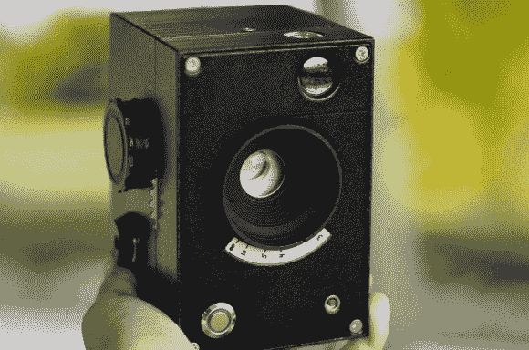

# 莱克丝:100%开源相机

> 原文：<https://hackaday.com/2014/01/15/lux-a-100-open-source-camera/>

[Kevin Kadooka]最近完成了他的开源相机。[Lux 相机](http://kekado.zapto.org/kevin/open.html)100%开源。Lux 没有使用其他相机的零件，甚至没有镜头！迄今为止，我们只见过用[针孔摄像机](http://hackaday.com/2013/09/08/use-your-new-timey-printer-to-make-an-old-timey-camera/)实现的。[Kevin]对摄像头黑客攻击并不陌生。他是 2013 年 2 月在 Kickstarter 上成功推广的[双人摄像机](http://www.kickstarter.com/projects/71185779/duo-a-diy-twin-lens-reflex-camera-for-instant-film)的幕后策划人。Duo 是一台 DIY 相机，但它仍然需要 Mamiya-Sekor 的镜头和 Seiko 的快门。莱克丝是不同的动物。它有一个手动对焦 65 毫米 f/5.6 单元素镜头。快门是[凯文]自己的[基于螺线管的叶片快门设计](http://hackaday.com/2013/10/23/arduino-controlled-single-leaf-shutter/)。就像最初的快门一样，Arduino 控制快门操作和定时。

相机主体及其许多部件都是 3D 打印的。[Kevin]从 Shapeways 3D 打印服务公司获得了一些质量非常好的零件。我们不得不说，一些组件对于桌面打印机来说看起来有点复杂。然而，由于一切都是开源的，任何愿意花时间的人都可以将它们用于普通的 RepRap 或 Ultimaker。[Kevin]在他的[Flickr 流](http://www.flickr.com/photos/frostedbutts/sets/72157638372089455/)上发布了详细的建造照片，以及一些用 Lux 拍摄的照片。这些照片有着明显的[霍尔加风格](http://en.wikipedia.org/wiki/Holga_camera)的外观，部分是由于单一元素镜头。尽管有这个限制，我们还是喜欢完全从零开始打造一台[布朗尼风格相机](http://en.wikipedia.org/wiki/Brownie_(camera))的想法。