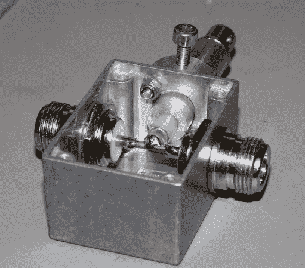

# 制作可变射频信号采样器

> 原文：<https://hackaday.com/2014/01/16/making-a-variable-rf-signal-sampler/>

[Brian]的爱好之一是业余业余业余无线电，通常需要检查传输的信号是否在规格范围内。由于涉及高电压，将无线电输出直接连接到测量设备并不安全，【Brian】制作了[他自己专用的 RF 信号采样器](http://www.briandorey.com/post/variable-rf-signal-sampler.aspx)。它的工作原理是利用你想要采样的信号和高阻抗输出之间的[电容耦合](http://en.wikipedia.org/wiki/Capacitive_coupling)。后者可以安全地连接到示波器或频谱分析仪进行监控。

在上图中，核心信号导体和输出之间的气隙起到了电容的作用。通过调整其长度，您可以改变输出信号的电压范围。取样器采用 52 x 38 x 27 毫米的压铸铝外壳制成。您可能已经猜到，由于外壳的几何形状，输出衰减将取决于信号的频率。[Brian]使用 30MHz 信号发生器测试了该装置，并在改变气隙的同时打印了[该频率衰减图](http://www.briandorey.com/docs/Variable-RF-Signal-Sampler/response.png)。