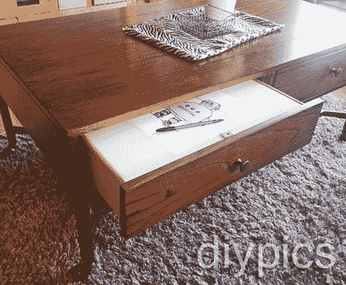

# 内置茶几灯箱

> 原文：<https://hackaday.com/2014/01/16/built-in-coffee-table-lightbox/>

[flying suppy]给我们发来了这个关于她巧妙隐藏的[拉出式灯箱抽屉](http://www.instructables.com/id/Built-in-Wireless-Light-Box-with-Secret-Storage/)的提示。她的新年决心是创作更多的艺术品，所以她在这张咖啡桌上放满了艺术用品，并决定在电视机前放松时画画。她还希望附近有一个[灯箱](http://en.wikipedia.org/wiki/Lightbox)，这原本需要用一些丙烯酸树脂来装饰整个桌面，但她最终选择了一个更简单的建筑:而且它还便于携带！抽屉的灯是电池供电的，所以你可以把整个东西从桌子上拿出来，拖到你的膝盖上，如果这样画画更舒服的话。

[flying suppy]从她当地的一元店购买了七个便宜的 LED 单元，她用一些螺丝将它们安装在抽屉的背面。抽屉的其余部分衬有白色泡沫板，底部倾斜，将光线反射到丙烯酸绘图表面。因为她需要打开盒子来手动打开灯，所以她用磁力固定了丙烯酸顶部，将磁铁粘在泡沫板的下面，并将一小块钢固定在丙烯酸上。在钢钻头上简单的一拉就打开了表面，提供了下面的通道。留下来看下面的视频。

[https://www.youtube.com/embed/PLUDSVdL_fg?version=3&rel=1&showsearch=0&showinfo=1&iv_load_policy=1&fs=1&hl=en-US&autohide=2&wmode=transparent](https://www.youtube.com/embed/PLUDSVdL_fg?version=3&rel=1&showsearch=0&showinfo=1&iv_load_policy=1&fs=1&hl=en-US&autohide=2&wmode=transparent)