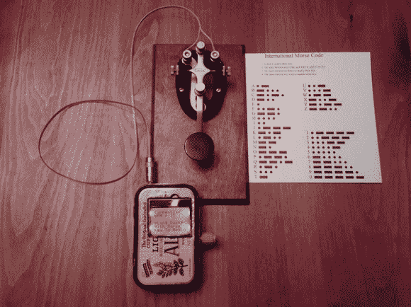

# 魔力莫尔斯 Arduino 训练器

> 原文：<https://hackaday.com/2014/01/17/magic-morse-arduino-trainer/>

魔力莫尔斯是一种数学算法，是[雷·伯内特]几年前编写的，目的是使发送和接收莫尔斯电码变得容易。当他第一次写的时候，他是为 PIC 设计的，但从那以后他重新写了一遍，作为 Arduino 平台的一个训练程序。

它可以在 Uno、Nano、Pro Micro 甚至自制的 Arduino 板上运行。他用诺基亚 5110 LCD 演示了该程序，但也包括了典型的 2×16 LCD 显示器的代码。神奇的莫尔斯算法是有版权的，但是他发布了 Arduino 代码作为开源代码，试图让人们再次使用莫尔斯代码——这非常棒。

那么它是如何工作的呢？该算法根据收到的“dits”和“dah”分配权重，当暂停时间较长时，该算法会创建一个指针，从 EEPROM 中存储的数组中调出字符。他在自己的页面上用 Excel 提供了一个例子。

现在你没有借口学习莫尔斯电码了！哦，如果你没有一个奇特的电报键(开关)，[Ray's]还公布了一个简便的方法，用冰棒和磁铁制作你自己的莫尔斯电码键。