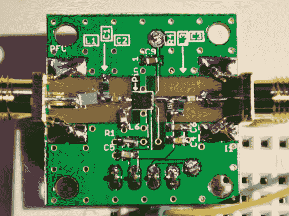

# 为 400MHz 无线电制作 20dB 低噪声放大器

> 原文：<https://hackaday.com/2014/01/19/making-a-20db-low-noise-amplifier-for-a-400mhz-radio/>

[威尔]最近向我们透露了他制作的 400MHz 低噪声放大器(LNA)模块。他的详细文章从解释放大链背后的理论开始。假设 50 欧姆的天线系统接收-70dBm 的信号，总的峰间电压将小于 200uV (.0002 伏)。如果第一个放大级不是由 LNA 组成，那么增加的噪声随后会被系统的其他元件放大。

[Will]然后详细介绍了他如何在 Digikey 上挑选他的 LNA，主要是通过寻找一个噪声系数小于 1dB[的。他的最终选择是 Sky65047:一款价格低廉的小型 0.4-3.0GHz 低噪声放大器，在 400MHz 时理论增益为 20dB。他制作了你可以在上面的图片中看到的 PCB，去除了信号路径上的阻焊膜，以降低](http://en.wikipedia.org/wiki/Noise_figure)[电容](http://en.wikipedia.org/wiki/Permittivity)。由于应用笔记中的一些错误，[Will]花了很长时间才使他的平台能够以 20dB 增益和 4.5dB NF 运行。他还使用定向耦合器测量了输入回波损耗，结果非常接近数据手册中的 14dB 数字。