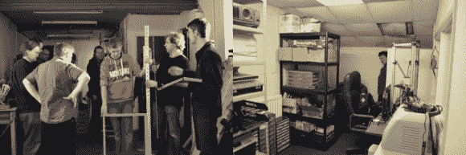

# 南安普敦的人民团结起来！镇上有一个新的创客空间！

> 原文：<https://hackaday.com/2014/01/20/people-of-southampton-unite-theres-a-new-makerspace-in-town/>

英国南安普顿的创客空间 **So Make It** ，刚刚[搬进了它的第一个专用空间](http://blog.somakeit.org.uk/2014/01/20/a-place-of-our-own/)，并将于 2 月 1 日举行盛大的开业典礼！

他们从 2013 年初开始正式存在，当时他们在一个自行车商店仓库的后面分享了一个 500 平方英尺的空间。虽然不多，但这是一个相当不错的临时住所。到 2013 年底，他们意识到自己已经大到可以拥有私人空间，于是决定尝试众筹。他们在筹集启动资金方面相当成功。

让我们所有人远离黑客的一天(还有你！)第一个祝贺 So Make It 获得了自己的私人空间！

我们当中有南安普顿的读者吗？如果是这样的话，请在休息后逗留一会儿，以便了解更多的细节，让我们来看看您可以在何时何地参加庆祝活动！

*我们非常荣幸地宣布，我们将举办我们第一个专属空间*的盛大开幕仪式:

2014 年 2 月 1 日
**下午 2 点**
(请从下午 1 点开始到达)

在
**南安普顿创客空间，**
**K6 单元，班轮工业区，**
**弗里曼特尔，**
**南安普顿 SO15 3FQ**

**[加入我们吧！](http://www.somakeit.org.uk/visit/)**