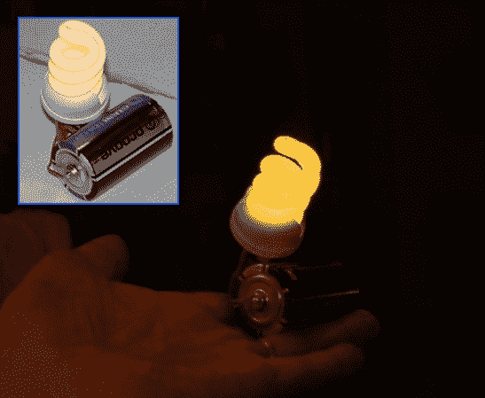

# CFL + Bugzapper =电池供电的野营灯

> 原文：<https://hackaday.com/2014/01/22/cfl-bugzapper-battery-operated-camping-light/>

知道不同的发光方式是一项很棒的技能，所以继续吧，把一个 [Bugzapper 和一个 CFL 灯泡](http://www.hackster.io/janost/the-cfl-camplight-bug)结合起来，把这个加入你的武器库中。

当然，如果你有交流电源，CFL(紧凑型荧光灯)自己就可以工作得很好，但我们在这里谈论的是让灯泡依靠单节 D 电池工作。几个月前，我们通过使用一个[焦耳小偷](http://hackaday.com/2013/07/15/fluorescent-light-powered-by-battery/)来获得荧光灯管的高电压，进行了一次类似的黑客攻击，但如果你无法获得分立元件，[Jan]向我们展示了另一种方法，通过为其升压板拆除网球拍 bugzapper。知道 bugzapper 将 3V 电压提升到大约 2000V，他决定看看同样的电路是否可以用一个 1.5V 的电池来驱动 CFL 电子管。小心翼翼地将电子设备从 CFL 外壳中取出后，[简]能够直接将升压板连接到荧光灯管的电极线上，瞧！他现在有一个 D 电池供电的野营灯，运行时间超过 200 小时。

看看这种方法在亮度和运行时间方面如何与焦耳-斯太尔方法相比较将会很有趣。在你把 CFL 灯泡的零件拆下来之前，一定要看看这份详细的 CFL 流行灯泡清单。