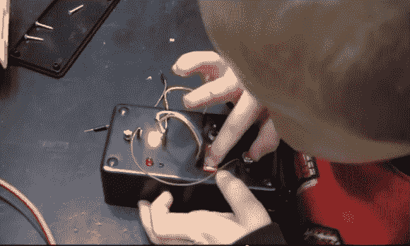

# 年轻有志黑客的教育电路盒

> 原文：<https://hackaday.com/2014/01/21/educational-circuit-box-for-young-aspiring-hackers/>

这里有一个好主意:你可以做一个[教育电路盒](http://www.electronhacks.com/2014/01/educational-circuit-box-diy/)来让孩子们对电子产品感兴趣！看起来像一个伸出电线的无聊项目盒可能会成为年轻人好奇和好奇的盒子。

[Fileark]为他的儿子建造了这个，并高兴地在他的博客上分享，供其他人重新创作。正如你可能从图片中猜到的，它利用了一个项目箱、发光二极管、按钮、开关和母头引脚。使用包括从易贝拿起的试验板跳线，它允许您的孩子通过插入不同的组件并观察会发生什么来学习电路。

他所用的大部分零件都是从他到处乱扔的废旧电子产品中回收的。这是一个很好的方法，可以把电子垃圾变成有趣的、对孩子有教育意义的东西！想了解更多关于这个项目的信息，请在休息后留下来看[Fileark]解释(和他的儿子演示！)它在一个视频里。

[https://www.youtube.com/embed/T82lGA9aaww?version=3&rel=1&showsearch=0&showinfo=1&iv_load_policy=1&fs=1&hl=en-US&autohide=2&wmode=transparent](https://www.youtube.com/embed/T82lGA9aaww?version=3&rel=1&showsearch=0&showinfo=1&iv_load_policy=1&fs=1&hl=en-US&autohide=2&wmode=transparent)

有趣的事实——视频的 YouTube 网址以“aww”结尾！