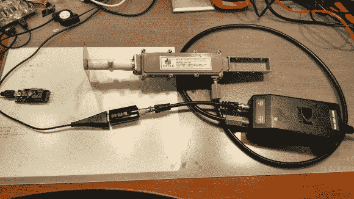

# 嗅探和解码蓝牙 LE 广告包和 NRF24L01+通信。不到 30 美元

> 原文：<https://hackaday.com/2014/01/22/sniffing-and-decoding-bluetooth-le-advertising-packets-and-nrf24l01-comms-for-under-30/>

[Omri]刚刚记录了他的旅程，他以非常低廉的价格从空中嗅出并解码了流行的 NRF24L01+收发器所使用的协议。由于他正在设计网状网络代码，需要一种方法来监控/调试整体网络性能，[Omri]决定寻找一些 RF 硬件。

我们相信大多数读者都熟悉[软件定义无线电](http://en.wikipedia.org/wiki/Software-defined_radio) (SDR)，不久前，当一些工程师在 Realtek RTL2832U 芯片中发现隐藏寄存器时，它开始流行，允许许多 DVB-T 加密狗转换为 RF 侦听设备。对[Omri]来说不幸的是，大部分的最高听音频率为 2.2GHz，而 NRF24L01+的发射频率为 2.4GHz，解决方法？从速卖通购买 2.2-2.4GHz 天线，带[低噪声下变频器](http://en.wikipedia.org/wiki/Low-noise_block_downconverter) (LNB)，用于[多频道多点分发服务](http://en.wikipedia.org/wiki/Multichannel_Multipoint_Distribution_Service) (MMDS)。因此，LNB 接收 2.2-2.4GHz 信号，并将其下变频至 400MHz 左右，允许任何 RTL-SDR 兼容的 DVB-T 加密狗监听 NRF 通信。然后编写一个[程序](https://github.com/omriiluz/NRF24-BTLE-Decoder)来解码 RF 信号并实时输出嗅探到的数据。