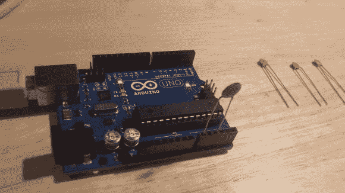

# 使用 Arduino Uno 进行电容测量

> 原文：<https://hackaday.com/2014/01/22/capacitance-measurement-with-the-arduino-uno/>

你有没有发现测量电容器电容的需要？手边没有万用表(惭愧)？事实证明，您可以使用 Arduino Uno 测量电容，无需外部元件，只需大约 20 行代码。

[Jonathan Nethercott]出色地解释了电容测试电路，该电路使用参考电容来计算未知电容。他进一步解释说，使用 Arduino Uno，您可以从电路中移除基准电容，只需使用电路板和微控制器中存在的杂散电容，这是可以计算的。这样，测试电路就像将电容插入 A0 和 A2 引脚一样简单。代码非常简单:它向电容器发送 5V 脉冲，测量另一端的电压，每半秒循环一次，并将数据输出到图表上。

然而，它需要校准。[Jonathan]测量了一个已知的基线电容，并使用该数据计算了 Arduino 中的杂散电容。校准后，他发现 3.5pF 至 225pF 之间的电容可轻松实现约 1%的分辨率，0.5pF 至 1300pF 之间的电容可实现约 5%的分辨率——点击此处查看他的分析结果。他还计划确定精度和线性度，但他需要一些非常精确的基准电容。