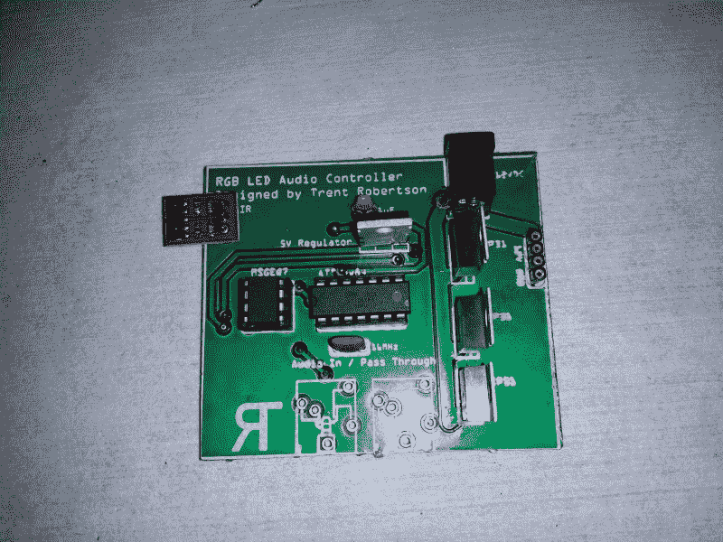

# 烟头灯:从没有太阳照耀的地方发出的光

> 原文：<https://hackaday.com/2014/01/23/the-butt-lamp-light-from-where-the-sun-dont-shine/>

[特伦特]是那种能让事情发生的人。他的一个朋友送给他一个人体模特臀部，只是因为他知道(特伦特)会用它做些有趣的事情。“好玩的东西”竟然是[音无功 LED 屁股](http://www.youtube.com/watch?v=Po5eAXThBZQ)。乍一看，这听起来就像是另一个光器官。这个屁股上有一些小把戏…值得仔细观察的袖子。光线来自一些现成的 5050 型 RGB LED 灯条。控制器是[特伦特]自己设计的。他从曾经流行的 [MSGEQ7 7 波段图形均衡器](http://www.mix-sig.com/index.php?option=com_content&view=article&id=145%3Amsgeq7-&catid=52&Itemid=55)显示滤波器、[一个我们之前见过的芯片](http://hackaday.com/2013/08/07/soundball-bumps-to-your-tunes/)开始。MSGEQ7 执行所有频带滤波，并输出与该频带中输入信号幅度相对应的 7 个模拟电平。输出馈入 ATTiny84，它通过晶体管驱动 RGB 条。

ATTiny84 不仅仅运行 PWM 环路。启动时，它从每个频带抽取 10 个样本。然后对这 10 个样本进行平均，并用于创建噪声滤波器。噪声滤波器有助于消除麦克风产生的任何环境声音或失真。然后对每个频带进行平均并检测峰值。峰值和噪声之差就是该频段的动态范围。ATTiny84 将每个模拟样本重新映射为适合该动态范围的 8 位值。最后一步是通过伽马查找表转换重新映射的信号值。创建伽玛表是为了让亮色和暗色更加突出。[Trent]说最终结果是小军鼓和底鼓听起来比其他音乐更流行。

不想让这盏灯成为太多笑话的笑柄，我们想说我们喜欢[特伦特]所做的一切。绝对是声音反应灯里的硬道理。点击查看[特伦特的]印刷电路板，并在行动中的对接灯。

[https://www.youtube.com/embed/Po5eAXThBZQ?version=3&rel=1&showsearch=0&showinfo=1&iv_load_policy=1&fs=1&hl=en-US&autohide=2&wmode=transparent](https://www.youtube.com/embed/Po5eAXThBZQ?version=3&rel=1&showsearch=0&showinfo=1&iv_load_policy=1&fs=1&hl=en-US&autohide=2&wmode=transparent)