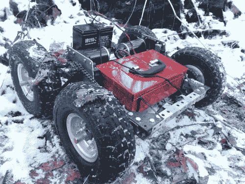

# 全地形遥控车的扭矩比你爷爷的轮椅还大

> 原文：<https://hackaday.com/2014/01/23/all-terrain-rc-car-has-more-torque-than-your-grandpas-wheelchair/>

[查尔斯]和他的哥哥已经是他们学校第一个机器人团队的成员很多年了，利用他们在此期间获得的一些知识，他们组装了这辆令人敬畏的全地形、超级大功率遥控汽车——很快就是机器人。

它像一个坦克一样建造，使用 1 英寸的方形钢管和由 1/8 英寸厚的钢制成的定制角支架。重型 U 型螺栓支撑着超大尺寸的 5/8″车轴，所有部件都使用#35 滚子链驱动。一个大型的 12V 密封铅酸电池为两个 CIMs(第一机器人电机)和[以及 yMark CIMple 变速箱](http://www.andymark.com/CIMplebox-p/am-0734.htm)提供动力——这些给了汽车数吨的扭矩，它甚至可以做车轮运动！

这个项目真正酷的部分是远程控制的方法。他正在使用一个常规的旧 Xbox 控制器，Arduino Uno 通过 USB 主机屏蔽和原始的 Xbox USB 接收器来收听。简单，但完全有效。

该项目尚未完成，他计划为其配备完整的照明设备、更大的电池、防滚架、摄像系统和某种操纵工具。休息之后，请观看试驾视频！

[https://www.youtube.com/embed/Yz-KQKAffAk?version=3&rel=1&showsearch=0&showinfo=1&iv_load_policy=1&fs=1&hl=en-US&autohide=2&wmode=transparent](https://www.youtube.com/embed/Yz-KQKAffAk?version=3&rel=1&showsearch=0&showinfo=1&iv_load_policy=1&fs=1&hl=en-US&autohide=2&wmode=transparent)