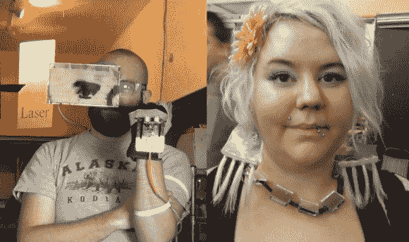
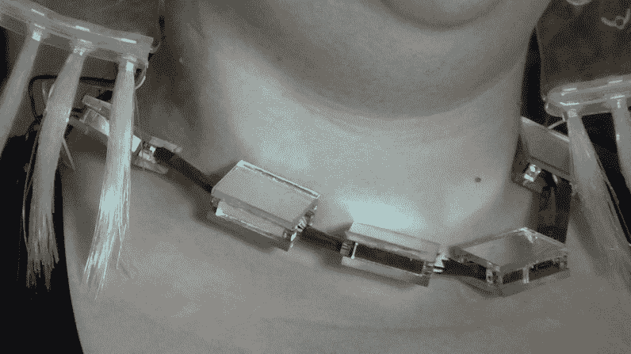
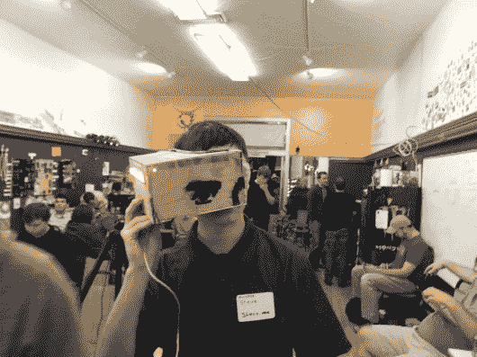
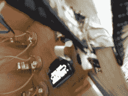

# HackPhx 年冬季黑客马拉松获奖者

> 原文：<https://hackaday.com/2014/01/24/hackphx-winter-2014-hackathon-winners/>

2014 年冬季黑客马拉松在美国亚利桑那州梅萨市的 Heatsync 实验室黑客空间举行。广告主题是“Arduino 可穿戴设备”。参与的与会者被随机分配到各个小组，这些小组根据他们在所有小组中公开的技能平均分布。共有 10 支队伍，每支队伍有 4 至 5 名成员争夺两个优胜名额。

每个团队都必须利用秘密成分构建一个令人惊叹的可穿戴项目，秘密成分是 [Seedstudio 的 Arduino 兼容 Xadow 可穿戴平台](http://www.seeedstudio.com/depot/s/xadow.html)和附加组件。Xadow 类似于 Arduino Leonardo，参与者使用 Arduino 交叉兼容性和[引脚映射图](http://www.seeedstudio.com/wiki/Xadow_IO_pin_mapping)来帮助开发。

最高奖项是评委颁发的最佳完成和记录 Xadow 可穿戴团队项目奖。第二个奖项是评审团授予其他团队最喜欢的团队项目的奖项，而不考虑事件标准。

阅读更多关于获胜团队的信息，并在休息后观看他们的演示。

我已经打算参加黑客马拉松了。当我向 Hackaday 团队提到这一点时，他们也给我分配了拍摄和记录获胜团队的任务。完全披露:我忍不住注册成为一名团队成员，寻找一些黑客乐趣。

没有团队成员有使用 Xadow 平台的经验，所以竞争环境相当公平。Xadow 附加模块的范围很广，但团队只能盲目地从大量捐赠的 Xadow 附加模块中进行选择，如有机发光二极管显示器、LED 阵列、电机、加速度计、GPS、NFC 和 BLE。当团队开发他们的最终项目计划时，鼓励团队之间的交换。

该活动实际上是在黑客马拉松的前一天晚上开始的，当时进行了 4 个小时的会面和问候，分成几个小组并完成硬件交易。真正的事件从第二天早上 8 点开始，持续了连续 12 个小时的疯狂黑客攻击，使用了 Heatsync 实验室提供的任何工具和用品。Heatsync 实验室提供经验丰富的志愿者来帮助需要使用实验室设备的团队，如激光切割机、3D 打印机、焊接机、金属车床或任何电动工具。

在晚上 8 点开始评判之前，所有团队代码、照片和最终文档都必须上传到[每个团队的 GitHub 库](https://github.com/hackphx-arduinowearables)。

  Morse code Jelly Friend Earrings  Flashing HackPhx in Morse code  Controller and Bluetooth reciever module hidden in necklace

硝烟散尽后，评委们选出了戴着“莫尔斯码耳环”的第八组冠军。这真的是一个令人惊讶的可穿戴黑客，尤其是如果你考虑到他们在黑客马拉松中途放弃了他们的第一个项目，并重新开始了获胜的项目。第 8 小组利用 Xadow 蓝牙 LE 模块从手机向一条隐形接收项链发送文本信息，这条项链包含一个 Xadow，它通过闪烁的“果冻朋友”LED 耳环以莫尔斯码调制信息。耳环也是由团队 8 使用透明丙烯酸激光切割成水母的形状，并有一个 led 底座和一些旧的圣诞树光纤照明部件。拥有这种装饰性通信的一大好处是，当你发现自己被可怕的公司缠住时，可以向附近的女朋友发送 SOS 请求。或者偷偷对你的老板说脏话。

团队 8 成员:

*   玛蒂·芬尼——薄纱之光
*   詹姆斯·布鲁克斯——派罗布鲁克斯
*   Nate plamondon-mez nak
*   布雷特·沃纳–布雷特沃纳

  Experiencing a new reality  The OLED display attached to the back of the head unit  How the user sees the OLED display in the 2 reflecting mirrors

“超过 9000”的 4 队获得评审团大奖。这位获奖者是由所有其他团队选出的，我必须说我的团队成员非常棒；是的，我在第四组。我的团队成员在学习这个新的硬件平台方面非常有天赋。几乎不费吹灰之力，在有时间的情况下，他们很快将硬件、代码和碎片集成到一个可穿戴的头戴式平视谷歌眼镜风格的交互式全功能增强现实头盔中。我说“他们”是因为我只负责手套单元和布线。手套单元从安装在手套背面的视差超声波 ping 传感器获取以英尺和英寸为单位的距离测量值，并通过电缆连接到头部单元的背面。

项目名称来自安装在主机上的加速度计输出。一旦加速度计的功率单元输出达到 9000，侧面的所有 led 将变为红色，指示最大功率水平活动。该功率单位值以及到手套单元前面的物体的距离测量值从安装在头部单元后面的有机发光二极管显示器内部反映到佩戴者的右眼中。如果手套检测到 3 英尺以内的物体，安装在前面的红色 LED 也会亮起，警告无辜的旁观者。车头单元的背面预先布线，用于顶起辅助车外传感器和设备，以简化集成和同化。

团队 4 成员:

*   Chad Tech–Chad cs
*   Joe Fleming – w33ble
*   道格·谢里丹——德谢里达
*   托德·哈里森——托德芬

[https://www.youtube.com/embed/HlE_EU5okGE?version=3&rel=1&showsearch=0&showinfo=1&iv_load_policy=1&fs=1&hl=en-US&autohide=2&wmode=transparent](https://www.youtube.com/embed/HlE_EU5okGE?version=3&rel=1&showsearch=0&showinfo=1&iv_load_policy=1&fs=1&hl=en-US&autohide=2&wmode=transparent)