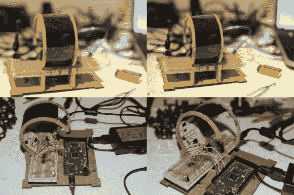

# DIY 曲面显示器利用了很酷的热变色特性

> 原文：<https://hackaday.com/2014/01/24/diy-curved-display-makes-use-of-cool-thermochromic-properties/>

马林·大卫在执行一项任务。一项任务是使用 Arduino、镍铬合金线和热变色液晶墨水构建他自己的弯曲显示屏。

他设计的原型使用了一张涂有热变色墨水的塑料板，弯曲在一个 MDF 框架上。这种特殊的热变色墨水在加热到 27 摄氏度左右时会变成亮蓝色。

为了显示数字，他通过将镍铬合金线缠绕在纸板上，然后粘在显示器的背面，创建了 7 段显示器的微小部分。每一个都由他的 Arduino Mega 单独控制。他认为你也可以用它来制作一个基本的点阵显示器——看看你能获得什么样的分辨率会很有趣！

要查看更多照片，请查看上面链接的原创设计新闻。我们不确定为什么大部分细节只在这个 PDF 文件中可用。如果我们只是错过了原始项目页面的直接链接，请在评论中告诉我们，我们会更新帖子。

对更多热变色黑魔法感兴趣？这些超赞的[温度敏感照片怎么样？](http://hackaday.com/2013/12/19/thermochromic-imaging/)或者用加热电阻照明的[数字钟面怎么样？](http://hackaday.com/2010/12/05/hot-resistors-used-for-color-changing-clock-face/)