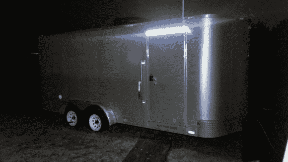
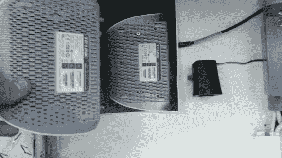

# 将 WiFi 带入移动黑客空间

> 原文：<https://hackaday.com/2014/01/25/bringing-wifi-into-a-mobile-hackerspace/>

[Philipp Protschka]有一个非常棒的移动黑客空间(MHS)预告片。唯一的问题？当你在一个基本上是法拉第笼的地方，你如何获得无线网络？

他不认为他会有问题，因为他有一个相当强大的路由器(Netgear R7000 Nighthawk)，离拖车不超过 20 米。但是一旦他关上了门，他就失去了所有的连接——他甚至看不到他的 SSID。让门开着一条缝会产生速度约为 54 兆比特的信号——还不错，但当外面很冷时，这真的不是一个选择。

解决办法？安装带有外置天线的 WiFi 中继器。他正在使用一个带有两个天线的 TP 链接站——他移除了一个天线，并将其连接到一个坚固的户外天线上，这让 MHS 看起来有点像 FBI 的货车——太棒了。中继器就位后，他突然可以从内部访问附近超过 24 个 SSID！它在旅行时也非常方便，因为有了额外的覆盖范围，他就可以轻松接入当地的 WiFi 网络。

他还为我们提供了一个背面有孔图案的表面贴装设备的专业技巧——只需复印一份设备，将复印件贴在墙上，然后在适当的位置钻孔即可！简单，但很巧妙。

别忘了看看他的 MHS 内部！