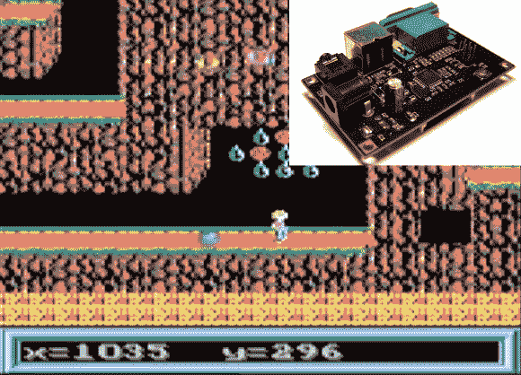

# 来自 Wayback 的更新:AVGA 重生为复古精灵

> 原文：<https://hackaday.com/2014/01/25/update-from-wayback-avga-reborn-as-retrowiz/>

这一次已经等了很久了。我们终于看到了基于 around 和 ATmega 芯片的复古游戏平台的更新。早在 2009 年的[中，它的新奇之处就在于使用 AVR 芯片的 VGA 输出(PAL ),而不是像大多数产品一样使用复合视频。](http://hackaday.com/2009/08/12/avga-the-avr-based-video-game-platform/)

好的项目永远不会消失，最近他再次拿起硬件，旋转一个主要是表面贴装板，并建立了一个新的网站来展示他的工作。上面你可以看到一个在硬件上运行的指挥官 Keen 4 的演示(下面的视频)。他还拥有一个相当神游的超级马里奥港口，并为硬件改编了(艾伯特·苏厄德的)吃豆人游戏。

该芯片的时钟频率为 32MHz，VGA 时钟频率为 19.6608 MHz。这给他 16 种颜色，分辨率为 192×144。他承认你可以从复合视频中获得更好的分辨率，但是谁需要复古游戏的分辨率呢？

[https://www.youtube.com/embed/CaUA60ZoGHs?version=3&rel=1&showsearch=0&showinfo=1&iv_load_policy=1&fs=1&hl=en-US&autohide=2&wmode=transparent](https://www.youtube.com/embed/CaUA60ZoGHs?version=3&rel=1&showsearch=0&showinfo=1&iv_load_policy=1&fs=1&hl=en-US&autohide=2&wmode=transparent)