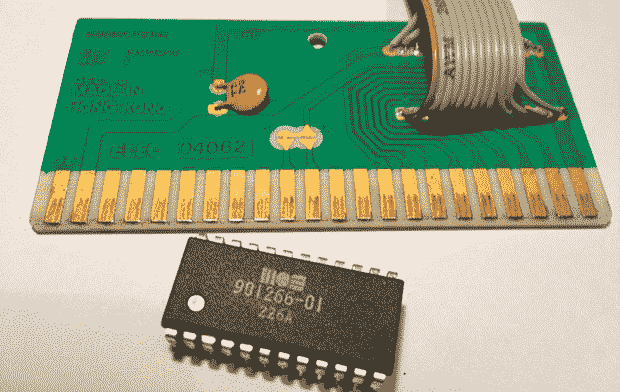

# VIC-20 的 Flash 游戏盒

> 原文：<https://hackaday.com/2014/01/27/flash-game-cartridge-for-the-vic-20/>

[Petri]的第一台计算机是备受尊敬的 Commodore VIC-20，它是 Commodore 64 的前身。它只有 5kB 的内存、一个非常简单的图形芯片和 BASIC，是一个非常适合 7 岁未来程序员的基本系统。[Petri]试图找出这台旧电脑的用途，并意识到这个简单的原理图可以让他使用现代硬件[再造那些经典的 VIC-20 弹药筒](http://petenpaja.blogspot.com/2014/01/vic-20-flash-memory-programmer-part-12.html)。

这个项目从打开几个游戏盒看看里面是什么开始的。它们是非常简单的器件，由一个去耦电容和一个直接连接到数据和地址总线的 ROM 芯片组成。[Petri]拆下 ROM，换上一根带状电缆，这样就可以给他一个干净的 VIC-20 扩展端口接口试验板。

没有找到当代的 EEPROM 芯片来编程，[Petri]决定使用闪存芯片。最初的盒式磁带有一个 16kB 的 ROM 芯片，但他能找到的最小的并行闪存芯片是 256k。没问题，那么；只要忽略一些地址行，一切都很顺利。

在让 VIC-20 读取试验板闪存芯片后，[Petri]开始研究一种电路，这种电路可以在他的闪存芯片仍然连接到扩展端口的情况下对其进行编程。通过几个缓冲芯片和一个加载了 Arduino 的 ATMega32a，他能够对闪存芯片进行编程，并将其转交给 VIC-20。

测试新电路只需要一个简单的测试，尽快切换屏幕的颜色。现在，[Petri]终于可以开始为他的初恋编写一些游戏了。

[https://www.youtube.com/embed/HjBKyWvgfRQ?version=3&rel=1&showsearch=0&showinfo=1&iv_load_policy=1&fs=1&hl=en-US&autohide=2&wmode=transparent](https://www.youtube.com/embed/HjBKyWvgfRQ?version=3&rel=1&showsearch=0&showinfo=1&iv_load_policy=1&fs=1&hl=en-US&autohide=2&wmode=transparent)