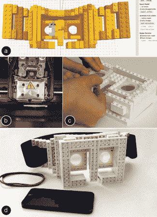

# 制造:乐高和 3D 打印的结合

> 原文：<https://hackaday.com/2014/01/28/fabrickation-combining-lego-and-3d-printing/>

虽然 3D 打印让你有能力制造完全定制的零件，但它也有一些缺点。一个问题是印刷大量书籍的时间和成本。这些结构通常很简单，不需要完全定制的设计。

这就是制造系统的用武之地。它允许你将 3D 打印部件与现成的乐高积木结合起来。让你“乐高化”设计的 CAD 工具。它创建如何组装乐高零件的指导，并导出零件的 STL 文件以进行 3D 打印。这些定制的砖块咬合到乐高结构中。

在他们的演示中，一个头戴式显示器在 67 分钟内建成。同样的设计需要超过 14 个小时才能 3D 打印出来。随着设计的改变，乐高积木被无缝地添加和移除。

不幸的是，这个工具似乎不是开源的。它将出现在关于计算系统中人的因素的 ACM CHI 会议上，所以希望我们将来能看到更多。在此之前，您可以在休息后观看演示。

[https://www.youtube.com/embed/_bapIwyY7VY?version=3&rel=1&showsearch=0&showinfo=1&iv_load_policy=1&fs=1&hl=en-US&autohide=2&wmode=transparent](https://www.youtube.com/embed/_bapIwyY7VY?version=3&rel=1&showsearch=0&showinfo=1&iv_load_policy=1&fs=1&hl=en-US&autohide=2&wmode=transparent)