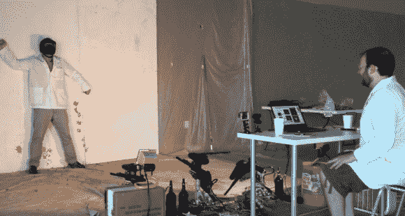

# 毕加索故意错过了它的猎物

> 原文：<https://hackaday.com/2014/01/31/paintball-picasso-purposely-misses-its-prey/>

这些年来，我们已经看到了相当多的自动彩弹标记系统。一般来说，这是同一个故事——一个运动探测系统用来瞄准并向对方队员、小偷、配偶等开火。[滑铁卢实验室]决定采取一种略有不同的方法，创造一个系统，故意错过它的目标。[彩弹毕加索](http://www.waterloolabs.com/#!paintball-picasso/c23ry)用一对蒂普曼 A-5 彩弹标记器在它视线内的人周围画出一个轮廓。对于滑铁卢实验室来说，这是一个相当安全的项目，考虑到他们之前在汽车冲浪中的[冒险。](http://hackaday.com/2009/11/10/remotely-control-your-crappy-car-dangerously/)

Picasso 彩弹系统使用网络摄像头捕捉自愿测试对象的图像。毕加索然后处理图像。人体轮廓绘制在 50×50 的彩弹像素网格上。然后真正的乐趣开始了。彩弹毕加索使用国家仪器 myRIO 命令两个彩弹标记器同时发射。这些标记配有高扭矩遥控式伺服系统，用于平移和倾斜。以每秒 10 发子弹的速度，标记器迅速画出人体轮廓。测试对象离开时会有轻微的飞溅，但在其他方面并无大碍。2500 点的矩阵，【滑铁卢实验室】有足够的分辨率画出一些基本的 logos。

我们喜欢[滑铁卢实验室]为标记创造的安装系统。他们混合使用 3D 打印部件、乐高 Tetrix、80/20 铝挤压件和滚珠轴承，制作了一个支架，它移动平稳，足以让遥控伺服系统启动，但又足够坚固，可以承受开火的冲击力。我们希望看到伺服电机换成步进电机和皮带传动。虽然开环，步进电机将提供更高的精度和更长的寿命比 PWM 驱动的 R/C 伺服。

[https://www.youtube.com/embed/9VCLxXFE3OA?version=3&rel=1&showsearch=0&showinfo=1&iv_load_policy=1&fs=1&hl=en-US&autohide=2&wmode=transparent](https://www.youtube.com/embed/9VCLxXFE3OA?version=3&rel=1&showsearch=0&showinfo=1&iv_load_policy=1&fs=1&hl=en-US&autohide=2&wmode=transparent)