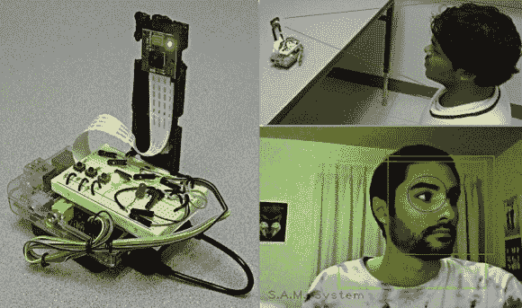

# 安全注意监视器

> 原文：<https://hackaday.com/2014/01/30/s-a-m-the-safety-attention-monitor/>

奇科州立大学上学期的项目希望通过在它注意到你没有注意(道路)时提醒你来减少司机分心。).

该团队设计的 SAM 使用 OpenCV 跟踪你的面部，以便识别你何时没有看路。它通过各种声音蜂鸣声和 LED 灯提醒您，并被编程为仅在设定的时间值后提醒您，即当您检查盲点时，它不会关闭，除非您已经检查了一定的时间长度。它还有一个静音按钮，你可以在停车时四处张望等情况下按下。

概念验证设备是使用 Raspberry Pi、PiCam 和试验板构建的，以容纳一些手动控制、蜂鸣器和 led。它还可以连续录制 30 秒循环的视频，如果发生事故，它会保存所有视频——也许证明是你的错。你能想象如果所有的汽车都安装了这个吗？从好的方面来看，你不必与保险公司争论——但如果这真的是你的错，那么你就真的不走运了。