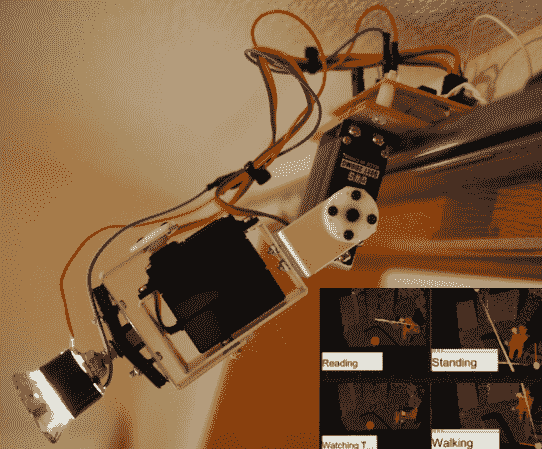

# 智能自主照明

> 原文：<https://hackaday.com/2014/02/01/autonomous-lighting-with-intelligence/>

进入家庭自动化通常从照明开始，比如在检测到运动时自动打开灯，定时器控制，甚至将一切都绑定到智能手机上的应用程序中。[Ken]将事情带到了一个完全不同的层次，通过[赋予他的灯光智能](http://kawalabo.blogspot.jp/2014/01/myra-intelligent-robotic-lighting.html)。

该系统被称为“Myra”，它通过检测你在房间里做什么来工作，并基于此，机器人灯将根据活动进行最佳调整。例如，如果你正在房间里行走，系统将试图在你行走时照亮你的道路。其他活动也可以被检测到，比如看书、看电视或者只是站着不动。

“Myra”系统的核心是一个 RGBD 传感器(微软 Kinect/华硕 Xtion)。房间中的空间由运行应用程序的 PC 处理，以确定当前的“活动”。无线机器人灯被战略性地放置在房间的周围；每个都有一个双伺服系统和独立的 Arduino。PC 向每个灯发出命令，命令带有两个轴的角度和灯的强度。灯光通过 315MHz 接收器无线接收该命令，然后 Arduino 根据该命令“瞄准”光束。

这不是我们第一次看到[肯]的作品；几年前，我们看到了他极其独特的“现实生活”天气展示。“迈拉”系统仍在开发中，所以我们迫不及待地想看到它的最终结果。休息之后，请务必观看视频，观看系统演示。

[https://www.youtube.com/embed/RPswQwxrpLc?version=3&rel=1&showsearch=0&showinfo=1&iv_load_policy=1&fs=1&hl=en-US&autohide=2&wmode=transparent](https://www.youtube.com/embed/RPswQwxrpLc?version=3&rel=1&showsearch=0&showinfo=1&iv_load_policy=1&fs=1&hl=en-US&autohide=2&wmode=transparent)