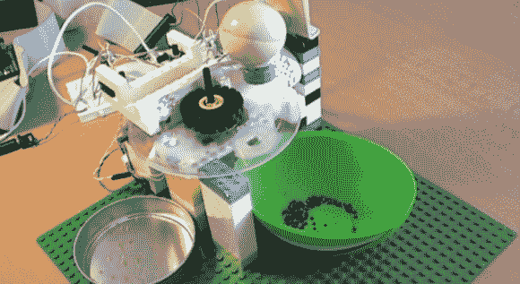

# 根据颜色自动分类珠子

> 原文：<https://hackaday.com/2014/01/29/automatically-sorting-beads-by-color/>

[托马斯]想尝试用电子控制建造一些机械的东西，最终有了这个分类器，它根据颜色将珠子组织成两个容器中的一个。他用[流行的互锁塑料砖](http://en.wikipedia.org/wiki/Lego)建造了大部分结构，然后添加了一个从旧扫描仪中回收的步进电机和两个塑料盘。

这两个圆盘叠放在一起。底部的那个是固定的，上面钻了两个孔，每个孔下面都有一个容器。顶部圆盘有一个较小的珠子大小的孔，并从其开始位置(收集一个珠子的位置)旋转到相机进行分析。在相机确定珠子的颜色后，圆盘再次旋转，将自己定位在下面圆盘上两个分类孔中的一个上，珠子落入等待的容器中。该设备由一个 [FITKit](http://merlin.fit.vutbr.cz/FITkit/) ( [翻译](http://translate.google.com/translate?hl=en&sl=cs&tl=en&u=http%3A%2F%2Fmerlin.fit.vutbr.cz%2FFITkit%2F))上的 MSP430 微控制器控制，这是[托马斯的]学校选择的开发平台。

[托马斯]最初试图通过使用 3 种不同颜色的发光二极管和一个光敏电阻来确定珠子的颜色，但后来改用网络摄像头和 Java 程序来捕捉图像并计算平均色调。你可以在他的网站上找到更多的细节和源代码，但首先要看下面的短视频。

[https://www.youtube.com/embed/1fz9hBMzR0M?version=3&rel=1&showsearch=0&showinfo=1&iv_load_policy=1&fs=1&hl=en-US&autohide=2&wmode=transparent](https://www.youtube.com/embed/1fz9hBMzR0M?version=3&rel=1&showsearch=0&showinfo=1&iv_load_policy=1&fs=1&hl=en-US&autohide=2&wmode=transparent)