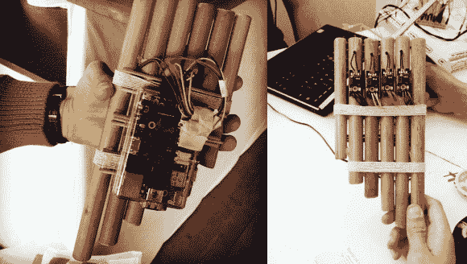

# 排箫英雄

> 原文：<https://hackaday.com/2014/01/30/pan-flute-hero/>

在永不停息的“__ Hero”乐器系列中，最新的作品是[这款由【斯文·安德松】和他的团队在 2013 年 WOW Hackathon 上制作的 Raspi-infined pan 长笛](http://www.pixelfolders.se/2014/WOWHack-2013.html)。笛子本身由来自当地花店的不同长度的竹子组成，剪短到足以手持，同时仍然从正面隐藏 Pi。在其他“英雄”乐器的精神中，排箫没有真正的音乐功能。每个管道都装有一个看起来像是[驻极体麦克风转接板](http://www.kjell.com/sortiment/el/elektronik/mikrokontroller/arduino/ljudsensor-for-arduino-p87888)，他们通过用胶水密封管道末端来保持这个位置。

传感器连接到 Raspi 上的 GPIO 连接器，该连接器与团队作为控制器中枢运行的本地 TCP/IP 服务器通信。这个游戏也是他们的原创，完全是在 LUA 写的。他们转向 Spotify 寻找合适的材料供玩家体验，用真实的 pan flute 歌曲创建播放列表，并使用 [libspotify SDK](http://developer.spotify.com/technologies/libspotify/) 访问音乐。你可以在下面的简短演示视频中看到该项目的最终结果。

[https://www.youtube.com/embed/lRgnxQoZh4M?version=3&rel=1&showsearch=0&showinfo=1&iv_load_policy=1&fs=1&hl=en-US&autohide=2&wmode=transparent](https://www.youtube.com/embed/lRgnxQoZh4M?version=3&rel=1&showsearch=0&showinfo=1&iv_load_policy=1&fs=1&hl=en-US&autohide=2&wmode=transparent)