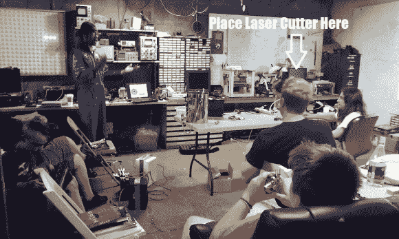

# 帮助伊萨卡发电机得到一个激光切割机

> 原文：<https://hackaday.com/2014/01/30/help-ithaca-generator-get-a-laser-cutter/>

纽约州北部的黑客空间 Ithaca Generator 正在为激光切割机开展 indiegogo 活动。随着最近[的火灾、](http://hackaday.com/2014/01/03/fire-at-the-geek-group/)和[的房东问题](http://hackaday.com/2014/01/25/help-save-nullspace-labs/)冲击黑客空间，我们认为提及一个做得很好并致力于扩展其工具的空间将是一件好事。发电机正在寻找购买 60 瓦激光切割机。灵活的资金活动设定为 3000 美元，他们~~距离~~刚刚达到的目标只有一步之遥！任何激光老手都会告诉你，3000 美元对于一家知名公司的 60 瓦型号来说是远远不够的。该组织已经有了一位捐助者，他将为该活动提供高达 4000 美元的最终资助。~~如果活动超出~~既然活动已经超出了他们的目标，额外的资金将用于新型激光器的排烟系统，以及备用透镜和零件。该集团还增加了延长保修和升级到 90 瓦激光功率的延伸目标。

许多捐赠额外津贴包括免费加入黑客空间。Generator board 的成员 Vic Aprea 告诉我们，外地的捐赠者可以将这些会员资格赠送给本地的任何人。对于康奈尔大学或伊萨卡大学的学生来说，会员资格是一份很好的礼物。想了解更多关于生成器和活动的信息，请查看他们的网站和休息后的视频。

[https://www.youtube.com/embed/EP94j3deC1g?version=3&rel=1&showsearch=0&showinfo=1&iv_load_policy=1&fs=1&hl=en-US&autohide=2&wmode=transparent](https://www.youtube.com/embed/EP94j3deC1g?version=3&rel=1&showsearch=0&showinfo=1&iv_load_policy=1&fs=1&hl=en-US&autohide=2&wmode=transparent)