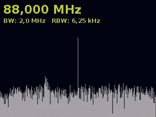

# 使用 RTLSDR 验证无线协议

> 原文：<https://hackaday.com/2014/01/31/verifying-a-wireless-protocol-with-rtlsdr/>

[德州人]正在开发一个系统，从他的公寓监控他的车库门。由于相隔七层楼，在门和公寓之间架设电线是不可行的，所以他转向了无线解决方案。在公寓里测试这个无线硬件没有问题，但是在现场测试就有点困难了。为此，他求助于带有 RTLSDR 加密狗的[软件无线电。](http://www.embeddedrelated.com/showarticle/548.php)

该项目的硬件基于 TI Stellaris 板和 [PTR8000 无线电模块](http://www.electrodragon.com/w/NRF905_Transceiver_433MHz-Wireless_Module)。这个项目的所有代码都是从头开始写的(Github [这里](https://github.com/texane/nrf))，这使得代码在第一次尝试时是否工作令人怀疑。为了测试他的代码，[Texane]挑选了一个基于 RTL2832U 芯片组的 USB 电视调谐器加密狗。这使他能够监控他的硬件应该发送的包的 433MHz 左右的频率。

之后，剩下唯一要做的就是为他的无线电模块写一个帧解码器。幸运的是，该模块的数据手册简化了这项任务。

[Texane]的 [Git](https://github.com/texane/nrf) 中有一个 NRF905 无线电模块的帧解码器。对于严肃的应用程序来说，它还不够好，但是对于测试一个简单的无线电链路来说，它已经足够了。