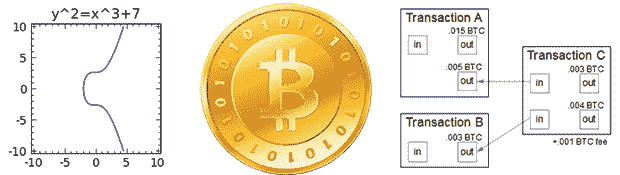

# 人工比特币交易

> 原文：<https://hackaday.com/2014/02/04/manual-bitcoin-transactions/>

对于用于购买药物和派遣牙买加雪橇队参加奥运会等平庸交易的东西来说，比特币等加密货币实际上是非常令人印象深刻的软件。这是一个非常巧妙的解决[两个将军问题](http://en.wikipedia.org/wiki/Two_Generals'_Problem)的方案，事实上它让一些比特币早期使用者变得非常非常富有，这也没有坏处。[【肯·希尔里夫】决定看看比特币协议](http://www.righto.com/2014/02/bitcoins-hard-way-using-raw-bitcoin.html)，通过创建一个比特币地址，手动将少量比特币转移到那个地址*。*这很好地展示了比特币协议实际上是如何工作的，以及这个协议实际上是多么的巧妙。

[Ken]的第一个任务是创建一个比特币地址。这是一个 256 位私钥，是比特币钱包私钥(编码为 ASCII 字符后)的基础，也是 512 位公钥(通过椭圆曲线算法发送后)。然后，用 SHA-256 和 RIPEM 160 对 512 位公钥进行散列，以生成 160 位公钥散列和比特币地址。

在创建了比特币地址和钱包后，[Ken]开始手动创建交易。这个想法是从比特币基地那里买几分钱(美元),然后寄到他手动创建的地址。这包括根据比特币规格创建一个交易并签署交易。对每一笔比特币交易进行签名是比特币安全的关键，这是通过用[比特币脚本语言](https://en.bitcoin.it/wiki/Script)编写的一小段代码来完成的。

用 Python 写好一切后，[Ken]准备将他的交易发送到比特币网络。这是通过在比特币网络上找到几个对等点并[发送几个数据包](https://en.bitcoin.it/wiki/Protocol_specification)来完成的。在网络上进行了一点点挖掘之后，[肯]的[交易通过了](https://blockchain.info/block-index/456667)，他的比特币钱包里有一笔存款证实了这一点。

从一个钱包手动发送几个比特币到另一个钱包，这是一个令人敬畏的记录和令人印象深刻的成就。更令人印象深刻的是，[Ken]提供了一些关于比特币协议如何工作的惊人见解，以及它的创建投入了多少工作。