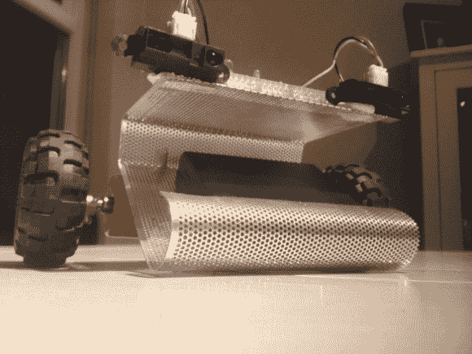

# 敏捷的闪避机器人超级容易受惊

> 原文：<https://hackaday.com/2014/02/04/nimble-dodgebot-is-super-skittish/>

在大学的一个机器人模块中，他的任务是制造一个小型机器人。他决定将项目 [Dodgebot，](http://robohoran.wordpress.com/2013/12/03/the-dodging-robot/)制作成一个可爱且速度极快的机器人，不会撞到东西！

车身由穿孔钢制成，支撑着带轮子的马达箱(也许是从玩具中偷来的)？) ，两个红外传感器，以及顶部包含电子设备的整洁原型板——认真检查上面的布线！

为了控制它，他使用了 18 针 dsPIC30F3012 和 SN754410NE 驱动器。机器人的工作原理是根据每个传感器的距离测量值检测不同的状态，然后改变每个电机的输出。这种速度非常快，看起来也很有趣，因为它似乎在躲避路上的一切！休息过后，你自己看吧。

[https://www.youtube.com/embed/yohauCuuijs?version=3&rel=1&showsearch=0&showinfo=1&iv_load_policy=1&fs=1&hl=en-US&autohide=2&wmode=transparent](https://www.youtube.com/embed/yohauCuuijs?version=3&rel=1&showsearch=0&showinfo=1&iv_load_policy=1&fs=1&hl=en-US&autohide=2&wmode=transparent)

希望有更邪恶的机器人？别忘了[罗德尼]的激光机器人[，它嘲弄了互联网上最受欢迎的宠物……](http://hackaday.com/2013/03/11/laser-toting-robot-taunts-house-cat/)