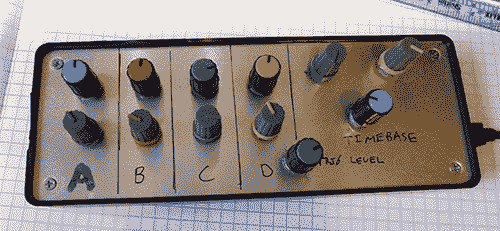

# 一个 USB 连接的编码器

> 原文：<https://hackaday.com/2014/02/04/a-usb-connected-box-o-encoders/>

[Colin]喜欢他的 PicoScope，一个基于 USB 的“无头”示波器。在使用它的时候，他发现自己渴望一个经典的示波器界面。鼠标点击并不能代替抓住一个刻度盘并转动它。为了纠正这种情况，他发明了他的 [USB 连接的 Box-o-编码器](http://www.colinoflynn.com/tiki-view_blog_post.php?postId=48)。这个盒子映射为一个 USB 键盘，所以它可以和几乎任何程序一起工作。

[Colin]从寻找编码器开始。有很多选择——花键轴或扁平轴、棘爪或无棘爪、面板、PCB 或底盘安装。他选定了 Bourns Inc .的编码器，该编码器使用 18 花键轴。他的编码器还包括一个用于选择的按钮开关。随着编码器的下降，旋钮是下一个。[科林]选择了两种截然不同的风格。这两种旋钮风格不仅仅是装饰性的。用户可以通过触摸来判断他们在哪一排旋钮上。使用 Teensy++ 2.0 使电子设备变得简单。[Colin]使用了运行 Teensy 软件的 ATUSBKey 设备，但他表示，就尺寸和简单性而言，Teensy 会是更好的选择。

一旦所有东西都连接到盒子里，[科林]发现当旋钮转动时，他的编码器会“旋转”。它们实际上被设计成 PCB 安装，然后拧入控制面板。试图拧紧面板安装螺母导致编码器损坏。[Colin]没有重新设计安装在面板上的编码器，而是使用少量环氧树脂来固定编码器主体。

软件设置很简单:每当编码器移动时，Teensy 输出一个独特的按键，用于编码器的 顺时针旋转、逆时针旋转和按键选择。PicoScope 软件键盘快捷键设置为响应编程到编码器盒中的按键。最后的结果很滑头。时基、通道电压和触发电平都像常规示波器一样工作。

[https://www.youtube.com/embed/UBAigawHrMw?version=3&rel=1&showsearch=0&showinfo=1&iv_load_policy=1&fs=1&hl=en-US&autohide=2&wmode=transparent](https://www.youtube.com/embed/UBAigawHrMw?version=3&rel=1&showsearch=0&showinfo=1&iv_load_policy=1&fs=1&hl=en-US&autohide=2&wmode=transparent)