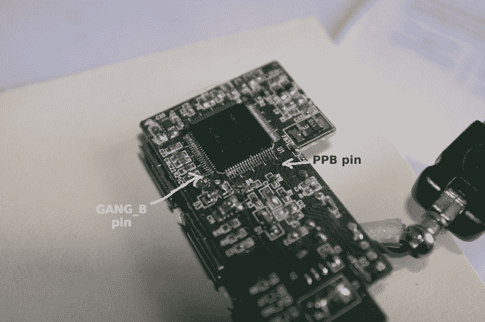

# 用于 USB 集线器的软件控制的每端口电源切换

> 原文：<https://hackaday.com/2014/02/05/software-controlled-per-port-power-switching-for-usb-hubs/>

 [Befi]想要为他的 ODROID 嵌入式主板服务器添加第二级备份磁盘，其空闲时的功耗通常为 1.5W。添加磁盘后，当新磁盘*没有*旋转时，他发现 2W 增加了功耗。他考虑过使用一个 USB 集线器，每个端口都有可爱的小摇杆开关，并用晶体管取代它们，但这将是混乱的。在查阅了一些 USB 标准后，他发现大多数都支持每端口电源切换(PPPS)，并着手[破解一个 USB 集线器以实现软件控制的每端口切换](http://befinitiv.wordpress.com/2014/02/02/hacking-per-port-power-switching-to-an-usb-hub-2/http://befinitiv.wordpress.com/2014/02/02/hacking-per-port-power-switching-to-an-usb-hub-2/)。

[Befi]的 NEC hub 使用了一个 [uPD720112](http://www.datasheetdir.com/UPD720112+download) 芯片，根据数据表，该芯片支持 PPPS。将标记为 GANG_B 的配置引脚连接到+3.3V 后，集线器声明自己是 PPPS 兼容的。当然，制造商通过省略单个开关节省了一两便士，所以[Befi]为每个端口添加了一个开漏 NMOS。他正在使用[这个程序](http://www.advistatech.com/software/hub-ctrl-20060120.c)来打开和关闭端口，并通过 autofs 实现透明切换。[Befi]的当前脚本具有硬编码的集线器的总线 ID 和设备 ID，但是他打算更新它以自动找到它们。这一招平均为他节省了 10W，相当于每年 30€(40 美元)。

如果你的集线器供电不足，你可以[尝试增加一个外部电源](http://hackaday.com/2013/05/25/add-external-power-to-any-usb-hub/)。