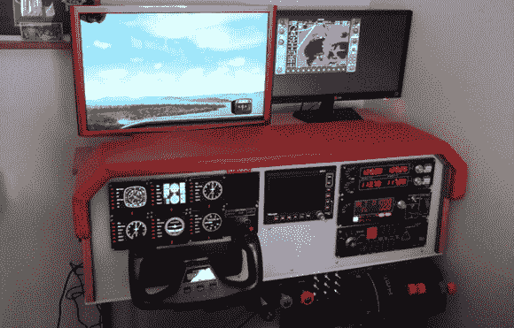

# 建造塞斯纳 172 模拟器

> 原文：<https://hackaday.com/2014/02/06/building-a-cessna-172-simulator/>

下载了微软飞行模拟器 X 或 X-Plane 的人都知道，使用键盘和鼠标驾驶飞机是行不通的。如果你想进入飞行模拟器的世界，最好全力以赴。[Stevenarango]知道这一点，于是[建造了一个巨大的塞斯纳 172 驾驶舱](http://www.instructables.com/id/DIY-Flight-Simulator-Cockpit/)供他个人使用。

所有的仪表、仪表板和控制器都来自赛德克公司，它是家庭/业余飞行控制器的最佳制造商之一。这些仪器安装在一块 5 毫米厚的 PVC 上，后者安装在一个 C172 驾驶舱大小的木架上。所有的仪器，从油门，踏板，轭，装饰轮，单个液晶蒸汽表，和多面板都是由 USB 驱动的。

至于实际的模拟，[Steven]正在使用一台相当强大的计算机运行带有双显示器的飞行模拟器 X——一个用于玻璃驾驶舱，另一个用于挡风玻璃。这与在你的车库里建造一架 737 飞机的规模不太一样，但对于在家体验一次令人敬畏的飞行模拟器来说，这已经足够了。