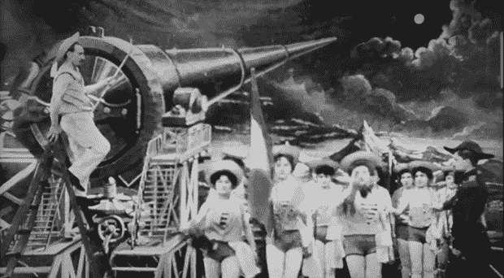

# Kickstarter 太空炮

> 原文：<https://hackaday.com/2014/02/08/the-kickstarter-space-cannon/>

就太空旅行和 Kickstarter 而言，我们已经看到了近地轨道卫星、撞击月球的众筹项目，甚至还有一个亚轨道火箭的项目。然而，这一个却是最棒的。这是一种设计用来在亚轨道上将非常小的有效载荷送入太空的枪。

这门炮本身是一门 8 英寸口径、45 英尺长的大炮。虽然最简单的沿枪管长度发射东西的方法是在后膛里引爆东西，但[理查德]正在做一些更有趣的事情。他分解了推进装药，所以不是一个巨人把子弹推进枪管，而是用许多更小的装药不断加速。

Kickstarter 的目标是将一个小的有效载荷送入亚轨道。后来的发展将包括在镖形子弹中放置一个小型火箭发动机，将有效载荷送入轨道。

这不是第一次有人试图制造一种能够向太空发射东西的枪。美国和加拿大国防部制造了一种能将 180 公斤重的炮弹发射到 180 公里高空的火炮。这个项目的首席工程师[吉拉德·布尔]接着与[萨达姆·侯赛因]一起设计了一种超级大炮，它可以将卫星发射到轨道上，或者将炮弹发射到特拉维夫或德黑兰的市中心。[公牛]在枪完成之前被美国、以色列、伊朗、英国或伊拉克政府暗杀。

下面是 Kickstarter 上的两个视频，在[项目的网页](http://www.starfirescientific.com/)上有更多的细节

[https://www.youtube.com/embed/FvVt89enslM?version=3&rel=1&showsearch=0&showinfo=1&iv_load_policy=1&fs=1&hl=en-US&autohide=2&wmode=transparent](https://www.youtube.com/embed/FvVt89enslM?version=3&rel=1&showsearch=0&showinfo=1&iv_load_policy=1&fs=1&hl=en-US&autohide=2&wmode=transparent)

[https://www.youtube.com/embed/n0ujqnensdM?version=3&rel=1&showsearch=0&showinfo=1&iv_load_policy=1&fs=1&hl=en-US&autohide=2&wmode=transparent](https://www.youtube.com/embed/n0ujqnensdM?version=3&rel=1&showsearch=0&showinfo=1&iv_load_policy=1&fs=1&hl=en-US&autohide=2&wmode=transparent)