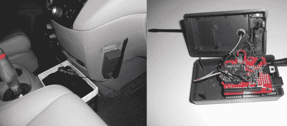

# 将家庭自动化升级到家庭预期

> 原文：<https://hackaday.com/2014/02/09/upgrading-home-automation-to-home-anticipation/>

[Bithead's]已经建立了一些家庭自动化，以便在他离开时控制他房子里的照明和温度，但他想更进一步，让房子自动预测他的到来并相应地调整环境。该项目利用[地理围栏](http://en.wikipedia.org/wiki/Geo-fence)在住宅周围创建一个周界，用于监听【Bithead】汽车中的收发器。几个月前，我们在[做了一个类似的项目，用一个 Raspi](http://hackaday.com/2013/10/13/raspi-z-wave-automation-is-automated/) 来锁车门。

[Bithead 的]实现使用一对带有 U.FL 天线的 Digi Xbee Pro XSC 无线电，以提供令人印象深刻的 2 英里以上的通信范围。家用 Xbee 连接到 Parallax Xbee USB 适配器，然后连接到他的计算机上——它的天线位于他家顶层的一个窗户附近，以最大化覆盖范围。对于他的车，[Bithead]最初选择了 Xbee shield 和 Arduino Uno，[，但他最近彻底改变了构造，改用 Arduino Fio](http://bithead942.wordpress.com/2013/12/30/car-proximity-v2/)，这减少了足迹，增加了里程。查看他的页面，了解构建日志细节和更多图片。