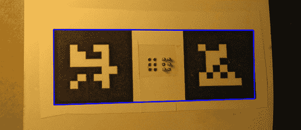

# 使用电脑阅读盲文

> 原文：<https://hackaday.com/2014/02/09/using-a-computer-to-read-braille/>

[Matthiew]需要创建一个允许计算机阅读盲文的系统。机电系统的开发会很烦人，而且随着系统的发展，需要许多硬件迭代。相反，他想出了一个更好的解决方案[，使用网络摄像头和 OpenCV](http://www.mattvenn.net/2014/02/08/using-a-computer-to-read-braille/) ，仍然获得 100%的准确性。

[Matthiew]使用 OpenCV 来检测阴影，而不是使用相机来寻找这个机械盲文显示器中升高或降低的大头针。这需要将相机校准到正确的角度，或者用 OpenCV 术语来说，姿势。

在看了 OpenCV 教程后，[Matthiew]发现了一个不失真棋盘图像的演示。使用同样的技术，他使用来自 ARTag 项目的基准点来正确校准他的机械盲文图钉的图像。

至于为什么[Matthiew]费尽周折让一台计算机阅读盲文——如果你仔细想想，这并没有太大的意义——他正在建造一个盲文电子书阅读器，这是一个令人惊叹的机械设计。我们也很想看到更多关于那个项目的信息。