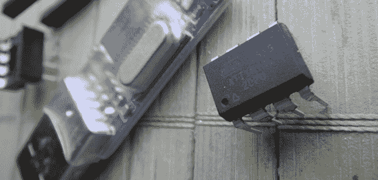

# 两分量随机数发生器

> 原文：<https://hackaday.com/2014/02/10/the-two-component-random-number-generator/>

[Karl]需要一个硬件随机数发生器，但是有几个注意事项:它需要便宜，并且足够随机。对于盖革管、熔岩灯和放射性衰变，随机数生成可能会变得非常疯狂，但在 8 引脚 AVR 微控制器中发现了一个小得多的解决方案[。](http://forums.hackaday.com/viewtopic.php?f=3&t=4189)

该解决方案使用 [AVRentropy](https://code.google.com/p/avr-hardware-random-number-generation/wiki/WikiAVRentropy) ，这是一个使用 AVR 微控制器中看门狗定时器的抖动来提供加密安全随机数的库。设置电路很容易——一个 ATtiny45 微控制器连接到一个便宜的中国 USB 到串行转换器。三根电线，电路就完成了。代码也很简单；这只是一个初始化熵并将位写入串行端口的调用。

这种结构有一些缺点。因为熵库必须等到聚集了足够的熵，所以每秒只能产生大约两个 32 位的数。不过，这就是[Karl]的应用所需的全部，而且他有一个由葡萄酒软木塞和大理石制成的外壳，这是他拥有的最漂亮、最小的随机数发生器。