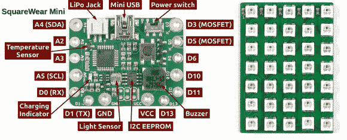

# 介绍 SquareWear Mini 及其可链接的彩色 LED 矩阵

> 原文：<https://hackaday.com/2014/02/10/introducing-the-squarewear-mini-with-its-chainable-color-led-matrix/>

[Ray]刚刚向我们透露了他的最新项目: [SquareWear Mini](http://rayshobby.net/?p=8309) ，它基本上是我们一个月前展示的 [SquareWear 2.0](http://hackaday.com/2014/01/12/squarewear-2-0-a-wearable-opensource-arduino/) 的改进版本。对于我们可能已经错过的读者来说，SquareWear 本质上是一个运行在 3.3V 和 12MHz 的可穿戴 Arduino 平台。这两个版本都基于运行 [V-USB 库](http://www.obdev.at/products/vusb/index.html)的 ATMega328 微控制器，以提供 USB 连接，并与各种板载外设放在一起。

正如你在上面的图片中看到的，Mini 包括 2 个[N-MOSFET](http://en.wikipedia.org/wiki/MOSFET)，一个温度传感器，一个光传感器，一个 16KB EEPROM 存储器，一个蜂鸣器，一个单芯 LiPo 电池连接器以及一个充电控制器，最后是一个电源开关(USB/电池)。它应该比 SquareWear 2.0 小 25%，并经过优化，可以与[Ray]也设计的基于 WS2812B 的 5×7 RGB LED 矩阵一起工作。后者可以容易地在 X/Y 方向上与其他 LED 矩阵级联，以便扩展整个显示器。

最后，[Ray]创造了一个软件来设计动画并上传到 SquareWear 上。休息后会嵌入完整系统的演示视频，您可以在 [GitHub](https://github.com/rayshobby/squarewear) 上下载所有设计文件。

[https://www.youtube.com/embed/-ncggm7W_4A?version=3&rel=1&showsearch=0&showinfo=1&iv_load_policy=1&fs=1&hl=en-US&autohide=2&wmode=transparent](https://www.youtube.com/embed/-ncggm7W_4A?version=3&rel=1&showsearch=0&showinfo=1&iv_load_policy=1&fs=1&hl=en-US&autohide=2&wmode=transparent)