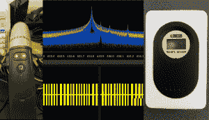

# 从吸尘器黑客到气象站逆向工程

> 原文：<https://hackaday.com/2014/02/11/from-vacuum-cleaner-hacking-to-weather-station-reverse-engineering/>

[斯波克]想对他的 Miele 牌遥控真空吸尘器做一点逆向工程，所以他拿出他的 DVB-T SDR 加密狗作为频谱分析仪。果然，他发现了他的吸尘器遥控器正在使用的 433.83Mhz 信号，但令他惊讶的是，当他预计 ~~an ASK~~ only one 时，他发现了一个杂散 ~~QAM256~~ 信号。

经过一点侦查工作，[斯波克]最终追踪到了一个他已经忘记了的廉价气象站。不过，气象站的规定对他来说太有吸引力了，他不想再回到他的吸尘器上。在~~下载了一个 rc-switch Arduino 库和~~在他当地的无线电小屋短暂停留以获得一个 433.92 无线电接收器来解码信号后，他逆向工程了气象站，这样他就可以数字记录温度输出。Arduino rc-switch 库被证明无法解码信号，但一些 Python 工作帮助他找到了问题的根源。

随着软件无线电变得越来越普及，像这样的黑客很好地提醒了我们，我们的房子变得多么有线。