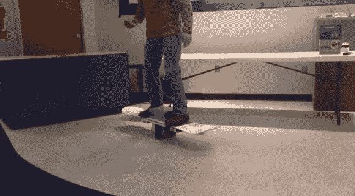

# 自平衡单板？

> 原文：<https://hackaday.com/2014/02/12/self-balancing-uni-board/>

有滑板，长板，滑雪板。这原本是一个滑雪板，但我们现在不太确定如何分类…介绍 [Segbot 滑雪板](http://www.youtube.com/watch?v=wdf3mZBIk4E)。

[Steve Ghertner]最近一直在研究加速度计，并决定尝试做一些实用的东西。他把一块滑雪板变成了一个双轮的类似赛格威的平衡板。两个平行的车轮分别由 12V 踏板车电机驱动。Arduino Uno 负责处理来自 MPU-6050 的数据，MPU-6050 是一种三轴陀螺仪和加速度计。

你可以靠着或者用一个小的双按钮遥控器来控制板子。他还没有把它带出实验室很远，但是计划在稍微清理一下程序之后。

请观看下面的视频，他在纳什维尔当地的黑客空间[Middle TN Robotic Arts Society](http://www.mtras.com/)解释道，在这里，会员们努力“在他们控制你之前控制他们(机器人)！”

[https://www.youtube.com/embed/wdf3mZBIk4E?version=3&rel=1&showsearch=0&showinfo=1&iv_load_policy=1&fs=1&hl=en-US&autohide=2&wmode=transparent](https://www.youtube.com/embed/wdf3mZBIk4E?version=3&rel=1&showsearch=0&showinfo=1&iv_load_policy=1&fs=1&hl=en-US&autohide=2&wmode=transparent)

对更多自平衡设置感兴趣？我们之前已经见过不少[自制赛格威](http://hackaday.com/2012/03/19/another-homebrew-segway-clone-comes-in-at-under-300/)了，但是看看这个可笑的[十二足个人交通工具吧！](http://hackaday.com/2010/11/26/dodecapod-to-offset-segway-as-futuristic-transport/)