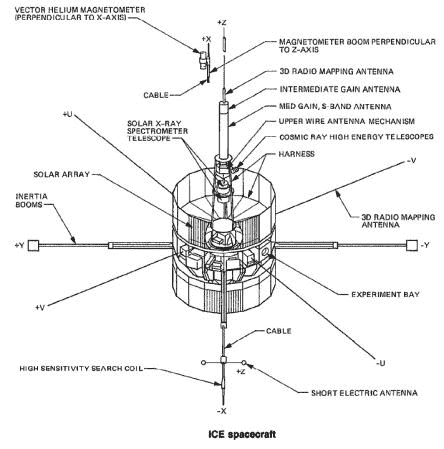

# 呼吁火腿和黑客:欢迎冰/ISEE-3 回家

> 原文：<https://hackaday.com/2014/02/14/call-for-hams-and-hackers-welcome-iceisee-3-home/>

美国最专注的太空探索飞船之一 ISEE 3 号正在返航途中。不幸的是，当它来到这里，没有人会和它说话。美国宇航局在近 15 年前退役了与卫星通信所需的设备。行星协会的 Emily Lakdawalla 多年来一直在跟踪这个长途旅行探测器。她最近关于这个话题的文章包括了这样的消息:美国宇航局在这场战斗开始前就已经放弃了。

该航天器最初被命名为“国际太阳/地球探索者 3 号(ISEE-3) ，于 1978 年 8 月 12 日由德尔塔火箭发射升空。它的任务是研究地球磁场和太阳风之间的相互作用。作为这项任务的一部分，ISEE 3 号成为第一个进入[光环轨道](http://en.wikipedia.org/wiki/Halo_orbit)的航天器。它通过将自己定位在太阳和地球之间的[拉格朗日点 L1](http://en.wikipedia.org/wiki/Lagrangian_point) 来做到这一点。1982 年，地球上的科学家正在为 1986 年飞越哈雷彗星做准备。ISEE 3 号被重新设计为彗星猎手，并更名为国际彗星探测器(ICE)。飞船飞回地球，进入月球轨道，距离月球表面不到 120 公里。它利用这一动量实现了一个日心轨道，并在轨道上与两个彗星相遇。ICE/ISEE-3 在 1985 年 9 月 11 日遇到了[彗星贾科比尼-辛纳](http://en.wikipedia.org/wiki/21P/Giacobini-Zinner)，收集数据并成为第一个飞过彗星等离子体尾部的航天器。虽然不被认为是哈雷彗星舰队的一部分，但当 ICE/ISEE-3 在距离哈雷彗星核心 2800 万公里的范围内通过时，对其进行了测量。从那时起，冰/ISEE-3 继续其 355 天的日心轨道。在 1997 年 5 月被关闭之前，它在 90 年代早期研究日冕物质抛射。请跟随我们一起度过休息时间，了解 ICE/ISEE-3 的命运。

1999 年，美国宇航局联系了探测器，以验证它仍在运行。所有系统都被确定为运行良好。2008 年 9 月 18 日，美国宇航局试图接收探测器的载波信号。令航天局惊讶的是，他们发现该探测器在 1999 年状态检查后从未关闭过。它仍在传输数据，令人惊讶的是，它的 13 个科学仪器中有 12 个仍在运行。

这让我们来到了 2014 年。冰/ISEE-3 正在回家的路上。它将于 8 月返回地球，与地球近距离擦肩而过。美国宇航局已经确定，联系 ICE/ISEE-3 所需的设备已于 1999 年从[深空网络](http://en.wikipedia.org/wiki/Deep_space_network) (DSN)退役。由于预算限制，重建设备是不可能的。如果美国国家航空航天局不联系 ICE/ISEE-3，也许制造商、黑客和业余无线电爱好者可以。ICE/ISEE-3 包括两个 5 瓦 S 波段转发器。接收信号可能不是大问题。然而，传输将会是。没有大型 DSN 天线的增益，联系将会很困难。这种努力由于在管理机构如美国 FCC 的规则内操作而进一步受阻。这似乎是一项不可能完成的任务，然而我们不禁绞尽脑汁，在网上搜寻解决方案。不仅仅是我们，[迈克·肯尼]整理了一份关于 ICE/ISEE-3 通信系统的[摘要。](http://mdkenny.customer.netspace.net.au/ISEE-3.pdf)[ICE/ISEE Facebook 页面](https://www.facebook.com/ISEE3returns)的读者也提出了一些计划。也许我们有点浪漫，但是如果地球上的普通公民完成了一个主要政府机构不能完成的事情——联系一个几乎被遗忘的太空探测器，这不是很好吗？

【谢谢安德鲁！[图片由美国宇航局提供]