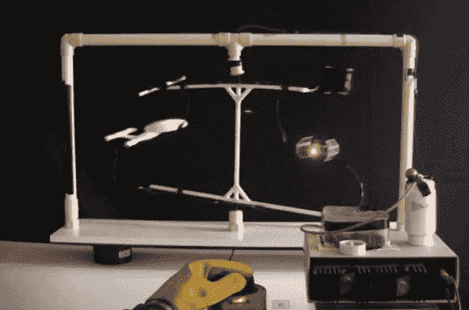

# 离子推进的 Tie 战斗机现在有激光了！

> 原文：<https://hackaday.com/2014/02/15/ion-propelled-tie-fighter-now-has-a-laser/>

[Steven Dufresne]最近一直在玩使用高压的离子推进，他在他的实验中增加了另一艘飞船——达斯·维德的 TIE 战斗机——作为额外的奖励，他还被扔上了一台激光器！

几个月前，在有人提到他在实验中产生的离子风看起来有点像企业号上的曲速驱动器后，我们最初报道了他的离子风推动的星际迷航企业号。有人指出 TIE 战斗机是更好的选择。毕竟，TIE 代表双离子发动机。所以他决定也建一个。离子风在这张图上看起来更好，因为他把战斗机的整个背部变成了电极，这产生了一个宽而非常明显的电弧。

哦，他还决定为它添加激光以获得额外的照明弹——不幸的是 TIE 战斗机使用绿色激光——而不是红色。请观看以下视频，了解 TIE 战斗机的离子荣耀。

[https://www.youtube.com/embed/oD_8_NZJF48H?version=3&rel=1&showsearch=0&showinfo=1&iv_load_policy=1&fs=1&hl=en-US&autohide=2&wmode=transparent](https://www.youtube.com/embed/oD_8_NZJF48H?version=3&rel=1&showsearch=0&showinfo=1&iv_load_policy=1&fs=1&hl=en-US&autohide=2&wmode=transparent)
(【http://www.youtube.com/watch?v=oD_8_NZJF48】链接如果嵌入不起作用)

[https://www.youtube.com/embed/VxIEV27AjWQ?version=3&rel=1&showsearch=0&showinfo=1&iv_load_policy=1&fs=1&hl=en-US&autohide=2&wmode=transparent](https://www.youtube.com/embed/VxIEV27AjWQ?version=3&rel=1&showsearch=0&showinfo=1&iv_load_policy=1&fs=1&hl=en-US&autohide=2&wmode=transparent)