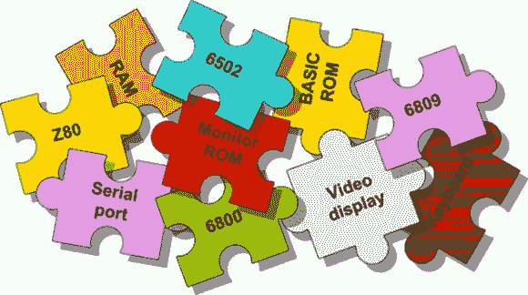

# 一种拾取混合 FPGA 逆向计算机

> 原文：<https://hackaday.com/2014/02/17/a-pick-and-mix-fpga-retrocomputer/>

廉价的 FPGA 板很容易买到，经典 CPU 如 6502、6809 和 Z80 的 VHDL 实现也很容易买到。到目前为止，我们还没有看到任何人将这两个部分结合成一个完整的系统，将 FPGA 板变成一个完整的 8 位逆向计算机。多亏了[Grant]的工作，[现在用一块 30 美元的 FPGA 板和一些零件就可以做到这一点](http://searle.hostei.com/grant/Multicomp/)(服务器着火，这是[的谷歌缓存](http://webcache.googleusercontent.com/search?q=cache:btyLT1AWpO8J:searle.hostei.com/grant/Multicomp/+&cd=1&hl=en&ct=clnk&gl=us))。

按照[Grant]的说法，Multicomp 的完整配置包括 6502、6809、Z80 或(未来的)6800 CPU。视频选项包括单色 RCA、RGB VGA 或通过 SCART 的 RGB。这一点，加上 SD 卡接口，PS2 键盘，以及连接外部 128kB RAM 芯片(64k 可用)的能力，意味着建立一个适当和完整的便携式逆向计算机是小菜一碟。

[Grant]的项目非常有趣的一点是，数据和地址线完全暴露在 FPGA 板上。这意味着你可以把任何你想要的电路加到任何你能想象的逆向计算机上；如果你想要几个 NES 游戏手柄，一个 IDE 接口，或者你想设计你自己的原始视频卡，这只是一个设计电路和编写一些汇编的问题。

如果您想自己构建，请在常见网站上搜索“EP2C5T144C8N ”,找到一些电阻和连接器，并看看[Grant]的文档和即将推出的示例。

via[6502.org 论坛](http://forum.6502.org/)