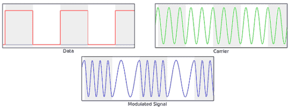

# GNU Radio 音频网络

> 原文：<https://hackaday.com/2014/02/19/audio-networking-with-gnu-radio/>

以为 GNU 电台只是用来广播的？再想想。[Chris]一直在努力将软件无线电的最佳工具[的信号生成和分析转变为扬声器和麦克风的网络设备](http://www.anfractuosity.com/projects/ultrasound-networking/)。

该装置使用 GNU 无线电产生载波信号，其频率由数据流调制。有了这个通过笔记本电脑扬声器传输的调制信号，[Chris]就可以在他的桌子上用声音发送 UDP 包了。

[Chris]最近使用了类似的技术通过 GNU Radio 的音频传输数据，但是这个最新的版本是一个巨大的改进；现在这是一个双工网络，意味着两台计算机可以同时传输和接收。

最终，[克里斯]创造了一种奇怪的、过时的设备，叫做“调制解调器”。它并不是很快。发送“Hello World”需要相当长的时间，正如你在下面的视频中看到的。

[https://www.youtube.com/embed/H0DKRl8XIcU?version=3&rel=1&showsearch=0&showinfo=1&iv_load_policy=1&fs=1&hl=en-US&autohide=2&wmode=transparent](https://www.youtube.com/embed/H0DKRl8XIcU?version=3&rel=1&showsearch=0&showinfo=1&iv_load_policy=1&fs=1&hl=en-US&autohide=2&wmode=transparent)