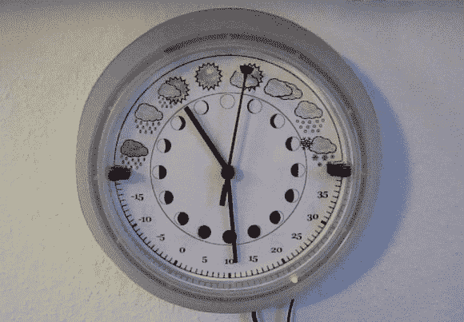

# 气象钟让 OLPC 开始工作

> 原文：<https://hackaday.com/2014/02/20/weather-clock-puts-olpc-to-work/>

告诉天气的钟？[Andrew] [已经发明了一种装置来做这个和更多的事情](http://outsideworld.org/blog.php?id=63)。受[【肖恩的】天气时钟](http://hackaday.com/2010/01/11/weather-clock/)的启发，【安德鲁的】时钟显示当前的天气状况、温度、月相，当然还有时间。整个项目始于几年前一个坏掉的键盘。[Andrew]想尝试使用键盘控制器 PCB 作为双向计算机接口。输入计算机的数据将通过密钥矩阵输入。输出数据将通过状态 led 读取。像 Arduino 这样便宜简单的微控制器板使这个项目搁置了几年，但他从未完全放弃它。

手里拿着一个没用过的 OLPC XO-1，安德鲁拿出他的旧键盘控制器开始黑客攻击。他的第一项任务是从键盘发光二极管中获取有意义的数据。他用 python 编写了自己的键盘 led 控件库。在硬件方面，运算放大器充当比较器的角色，确保存在正确的逻辑电平。[Andrew]然后将两个 led 作为时钟和数据线连接到标准 74 系列移位寄存器(最有可能是 74HC/HCT595)。他发现由于反弹，他的数据完全是乱码。缓冲时钟的第二个移位寄存器清理了一切。[Andrew]留下了一个稳定的 40 位/秒的串行链接到他的移位寄存器。做完这些，下一步就是时钟本身了。[Andrew]从宜家买了一个 RUSCH 挂钟，并把他从一个旧电话答录机上拆下来的发条装置改成了 DC 马达的齿轮减速装置。他现在可以随意移动指针，但无法确定它们的位置。旧打印机的红外光束传感器来拯救我们。

连接电机驱动后，[Andrew]仍有许多输出可用。几个发光二极管在他的零件箱里，所以他们进入了这个项目。时钟外部有 12 个发光二极管显示当前时间。3 个 led 隐藏在天气图标后面作为状态指示器。[Andrew 的] python 软件确实将这两者联系在了一起。他的 OLPC 从互联网上抓取数据，并显示在时钟上。网络界面允许用户手动更新时钟和设置闹钟。这些警报甚至通过 [eSpeak](http://espeak.sourceforge.net/) 整合了语音输出。我们喜欢在这个版本中重复使用和回收零件。最终的结果是一个任何黑客都会自豪地在他们的墙上展示的时钟。

[https://www.youtube.com/embed/2U8V04ID8gE?version=3&rel=1&showsearch=0&showinfo=1&iv_load_policy=1&fs=1&hl=en-US&autohide=2&wmode=transparent](https://www.youtube.com/embed/2U8V04ID8gE?version=3&rel=1&showsearch=0&showinfo=1&iv_load_policy=1&fs=1&hl=en-US&autohide=2&wmode=transparent)

[https://www.youtube.com/embed/T5rU-OXQX_Y?version=3&rel=1&showsearch=0&showinfo=1&iv_load_policy=1&fs=1&hl=en-US&autohide=2&wmode=transparent](https://www.youtube.com/embed/T5rU-OXQX_Y?version=3&rel=1&showsearch=0&showinfo=1&iv_load_policy=1&fs=1&hl=en-US&autohide=2&wmode=transparent)