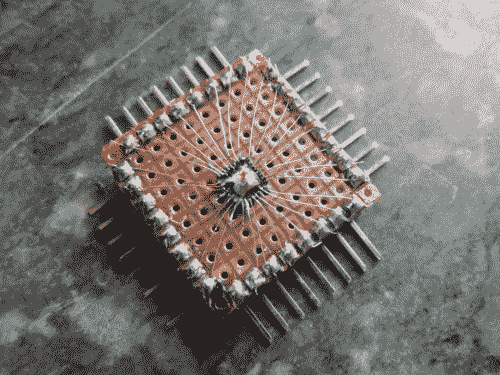

# QFN 突围赛很好看，钱包

> 原文：<https://hackaday.com/2014/02/21/qfn-breakout-is-easy-on-the-eyes-wallet/>

当 QFN 包装中的 ATMega328s 在您的 bug 箱中烧了一个洞，但您没有安装 SMD，并且只能有限地使用零件时，您会怎么做？你鼓起勇气，做了[Djpanjan]做过的事情:[用焊料、直角接头和许多细小漂亮的电线制作自己的分线板](http://letsmakerobots.com/node/40451)。

[Djpanjan]说这个过程很简单，但需要高度的专注。一旦他有了突破，他用热胶覆盖电线，以确保他们都留在原地。他作为 ISP 使用 Arduino 对它进行编程，他能够毫无问题地运行眨眼草图。他眨了眨所有的输出引脚，以确保没有短路。

[Djpanjan]说，如果他的 LQFP-144 不能获得突破，他将再次创造自己的突破。祝你好运，[Djpanjan]。我们都指望你了。

如果你准备进行 SMD 和蚀刻，总会有[表面贴装突破](http://hackaday.com/2010/04/29/surface-mount-breakout-boards/)路线。如果没有，你总是可以使用[磁线和原型板](http://hackaday.com/2013/06/25/solder-trick-to-make-your-own-surface-mount-breakout-boards/)。