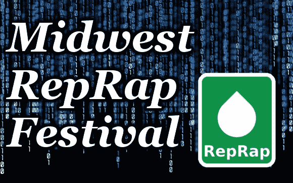

# 我们要去中西部说唱音乐节

> 原文：<https://hackaday.com/2014/02/21/were-going-to-the-midwest-reprap-fest/>

一个月后，印第安纳州的戈申——乳制品皇后区的深处——将成为重新包装、3D 打印和一切涉及开源制造的首要场所之一。这是第二届中西部说唱艺术节，将于 3 月 14 日至 16 日举行。哦，Hackaday 也将在那里，到处蹦蹦跳跳，分发一些赃物，并做一些活动的现场视频和帖子。

该节日的亮点包括[Prusa]发表关于开源印刷现状的演讲，[Sonny Monicou]讨论他的 RepRap 工作室面临的挑战，[Nicholas Seward]和他的作品的圆桌讨论——T2[Wally]T3、[辛普森](http://reprap.org/wiki/Simpson)和[丽莎](http://reprap.org/wiki/LISA_Simpson)，以及来自[Lulzbot](https://www.lulzbot.com/)和[ultimagine](https://ultimachine.com/)的一些人。基本上，去更大的 RepRap 大会的唯一方式是参观一个制造者集会，即使这样也只会增加几百个 9 岁的被印刷的《我的世界》雕像震惊的孩子。

如果你愿意开车，参加是免费的；只需[注册](http://midwestreprapfest.org/wordpress/?page_id=93)，出现，你就能得到一张表，记录所有午夜前的演讲。周日还有华夫饼早餐，我会四处逛逛，让它下雨。