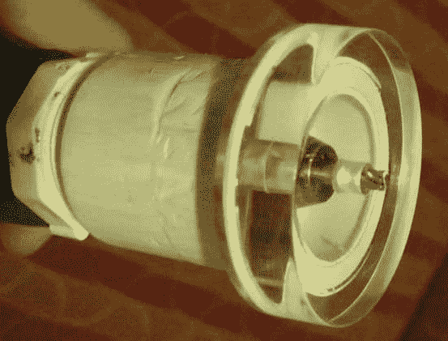
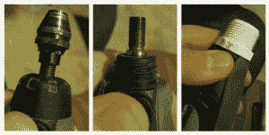
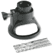
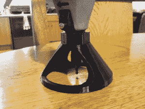

# DIY 路由器基地为您的 Dremel

> 原文：<https://hackaday.com/2014/02/21/diy-router-base-for-your-dremel/>

Dremel 旋转工具很方便。有些附件很方便。[vreinkymov]觉得这种便利得不偿失，所以他决定为他的 Dremel 做一个[路由器底座](http://www.instructables.com/id/Inexpensive-Dremel-Router-Attachment/?ALLSTEPS)。这些类型的附件用于保持 Dremel 垂直于工作面。

在 Dremel 主轴附近的小螺母/盖子下面，有一个 3/4 英寸-12 英寸的螺纹特征，用于连接附件。沿着五金店的管道通道快速走了一趟，发现了一个 PVC 异径管，它有正确的内螺纹，可以与 Dremel 相配。一旦安装在旋转工具上，减压器就拧入一个 PVC 螺纹接头，该接头粘在一块丙烯酸树脂上。丙烯酸树脂作为刳刨机附件的基础。

  Dremel 的官方路由器基地叫做 [565](http://www.dremel.com/en-us/Attachments/Pages/ProductDetail.aspx?pid=565) 。它上下滑动以调节钻头高度，并用一个翼形螺钉锁定。【vreinkymov】的设计利用了异径管和螺纹接头的螺纹，允许高度调节。如果这些螺纹有一点松动，可以钻一个孔，安装一个翼形螺钉，防止减压器和螺纹接头相对转动。

那些可以使用 3D 打印机的人可能会对 thingiverse.com 的这个[路由器附件](http://www.thingiverse.com/thing:17105)感兴趣。高度不可调节，但除此之外，它看起来很漂亮。

