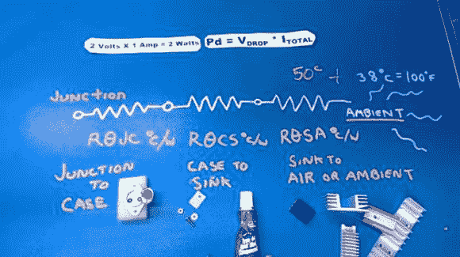
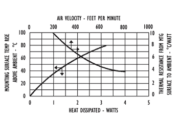

# 热不热？了解如何计算组件热量以及为什么应该这样做

> 原文：<https://hackaday.com/2014/03/03/hot-or-not-find-out-how-to-calculate-component-heat-and-why-you-should/>

[https://www.youtube.com/embed/H6lmt7AwMf0?version=3&rel=1&showsearch=0&showinfo=1&iv_load_policy=1&fs=1&hl=en-US&autohide=2&wmode=transparent](https://www.youtube.com/embed/H6lmt7AwMf0?version=3&rel=1&showsearch=0&showinfo=1&iv_load_policy=1&fs=1&hl=en-US&autohide=2&wmode=transparent)

您的关键部件有多热？很有可能你已经建立了一个项目，并认为:“好吧，我想我最好在那里拍一个散热器，以确保安全”。但是当处理一个更精细的构建时，你真的需要计算散热以确保可靠性。这其实一点都不难。数据就在数据手册上。是的，那份数据手册里塞满了数字、图表、表格、图形、标语、营销声明、订单编号……你知道该去哪里找，不是吗？

Hackaday 让你接手这个案子。在不到 10 分钟的时间里，[Bil Herd]不仅会向您展示这些计算有多简单，他还会告诉您在数据手册的哪里可以快速找到您需要的信息。

上图中，[Bil]用他的工作台作为白板来说明热阻方程。在这种情况下，每个电阻符号代表散热的一部分。你必须考虑热量可以传递的所有地方:(从左到右)元件芯片(结)到元件外壳，元件外壳到散热器，散热器到环境空气。他在视频中展示了这些耗散点。

Calculate thermal resistance – Theta Junction to Case Tjc

右侧显示了一个连接到案例的示例。这是一个被切掉盖子的 TO-3 箱子。这是一种比试图用塑料外壳封装元件更简单的查看芯片的方式。

#### 已经开始做数学了！

好的，好的，我们快到了。数学不难…只是乘法和加法，所以再坚持一分钟。

收集以下值:该元件计划使用的最大功率、器件的最大额定热功率、使用该元件的最大环境空气温度以及数据手册中的θ值。θ是每瓦特度数的量度，通常被列为一个符号:θ乘以最大瓦数，你就会知道你的方程式中要加入多少温度

#### 数据手册:查找θ和温度

因为[Bil]在视频中做得非常好，我们在这里给你一个快速版本。温度产生元件将包括如下所示的最高工作温度(点击查看完整数据表),这是线性调节器的最高工作温度:

在电气特性表的同一数据表中，可以找到“接头至外壳”的θ值。数据手册还将提供一个“结至环境”值(也显示在下面，但不用于我们的计算),用于计算在没有任何类型的主动或被动冷却的情况下，您可以使用多少功率。这回答了“我需要散热器吗？”。

最后，您需要查看正在使用的散热器的数值。[Bil]查看散热器的数据表，其中列出了 25.8θ的热阻，下方左侧的图表显示了随着空气流动(风扇)，该数值可能会发生变化。右边的图表介绍了导热脂等界面剂的使用，以及带有导热脂的云母垫(用于电绝缘)。这两个值都被圈起来，但是在计算中只使用一个。

|  |  |

#### 把所有的放在一起

如果我们假设环境空气温度为 38°C(100°F ),最大功率为 2 W，我们需要的所有数据都已收集。

最高温度=结+云母/油脂+散热器+环境温度

最大温度=(4μ*+(0.4μ*+(25μ*+)

最大温度=∞+∞最大温度@

最高温度= 96.8

该器件的最高额定温度为 125°C，这意味着该器件得到了适当的冷却。[Bil]在视频中更进了一步，展示了如何计算适当冷却的器件的可靠性。

#### 资源

*   德州仪器 LM317-N 数据表( [PDF](http://www.ti.com/lit/ds/symlink/lm317-n.pdf)
*   德州仪器安装到-3 封装的应用公告( [PDF](http://www.ti.com/lit/an/sboa020/sboa020.pdf) )
*   AAVID THERMALLOY [7173DG 散热器示例](http://www.aavid.com/products/standard/7173dg)