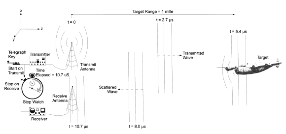
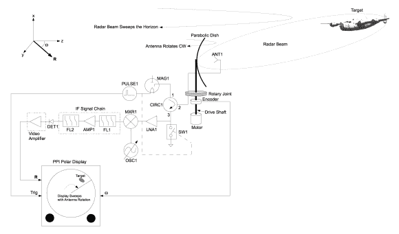
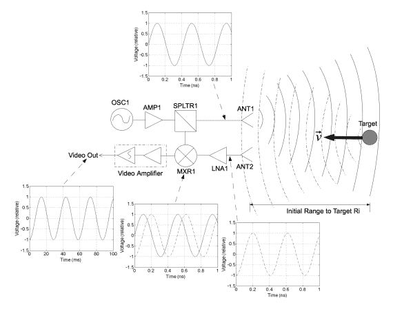
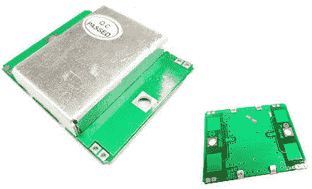
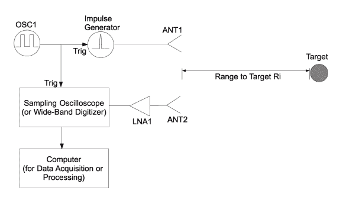
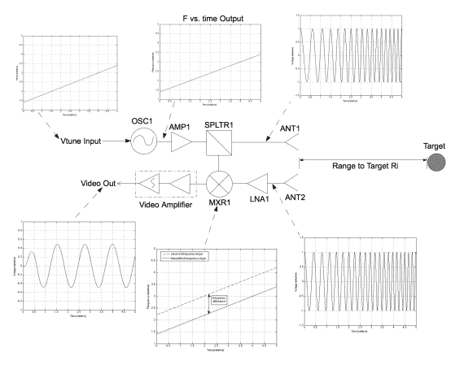
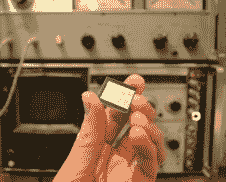
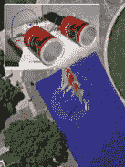
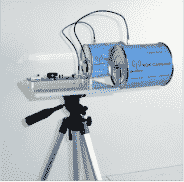
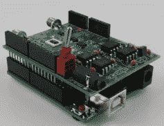

# 客座博文:为你的下一个项目尝试雷达

> 原文：<https://hackaday.com/2014/02/24/guest-post-try-radar-for-your-next-project/>

传感器。我们能拿到的低端产品通常射程很远，不够灵敏，而且无法确定目标是什么。但是今天我们可以使用直到最近还只有军方才能使用的好东西:雷达。在本帖中，我们将讨论雷达的工作原理、市场上可买到的小型雷达设备，以及在哪里可以了解更多信息，以便轻松地将雷达添加到您的下一个项目中。伸出手去感受一些东西！

## 雷达基础知识

Radar uses a radio transmitter and receiver to measure the time of flight from a transmitted radio wave that scatters off a target back to the receiver.

雷达很简单，它由无线电发射机和接收机组成。雷达是第二次世界大战的首字母缩略词，意思是无线电方向和测距，换句话说，雷达由无线电发射器和接收器组成，其中通过记录发射器发射已知调制波形和接收器接收从目标散射的波形之间的时间来测量到对象的距离。

This block diagram represents a conventional radar that comes to mind when you think about radar, you might find this design used on a fishing boat or commercial aircraft.

阴极射线管(CRT)是雷达的一项使能技术，它有助于测量发射和接收波形之间的时间延迟。这导致了第二次世界大战中使用的许多雷达传感器的发展，这些传感器通常遵循平面位置指示器(PPI)架构。

今天，我们可以使用高速数字化仪，而不是 CRT。这提供了将信号处理应用于获取的数据的明显优势，以便仅检测移动目标，可以实现跟踪、成像和多种其他模式。

但对于业余爱好者和消费者项目，我们不需要这么大的功率，范围，也负担不起成本。我们需要像远程雷达那样的感知能力(只探测移动目标、成像、多普勒、信号等)，但要在短距离内，而且成本要低。

迄今为止，很少有现成的小型雷达可供选择。在本帖中，我们将回顾这些，它们的基本架构，并指导您接下来的步骤。

## 连续波多普勒雷达

How CW Doppler radar works.

如果你对测距或成像不感兴趣，但想测量速度或雷达信号，那么考虑连续波多普勒雷达。连续波多普勒雷达的工作原理是将连续波振荡器的输出馈送到天线，并向移动目标辐射载波。该载波从移动目标散射回接收天线，在那里被放大并馈入混频器。混频器混合振荡器和散射载波，产生多普勒频移产物。该乘积是载波中心频率的多普勒频移，通常在 KHz 范围内。低到足以被膝上型计算机或其他低成本数字化仪的音频输入端口容易地数字化。

A low-cost X-band CW Doppler Radar Module, readily available on Ebay.

试试连续波多普勒雷达。通过找到视频放大器或混音器的输出，将该信号插入笔记本电脑的音频输入端口，并使用“水滴”傅立叶变换显示该数据，您可以[黑掉一把旧的警用雷达枪](http://hackaday.com/2012/11/01/hacking-an-old-radar-gun-to-interface-with-a-laptop/)。

如果你发现一个旧的运动传感器或开门器。这些通常使用连续波多普勒雷达模块称为耿氏。就像你用警察雷达一样黑进去。

或者，你可以在 Ebay 上花<10 美元从中国购买新的[现成的 X 波段连续波多普勒雷达设备。我以前用过这些设备，它们确实可以工作，但是范围有限。这对您的项目可能无关紧要。](http://www.ebay.com/itm/Wireless-Module-Microwave-Doppler-Radar-Motion-Sensor-/130512020245?pt=LH_DefaultDomain_0&hash=item1e631f6315)

## 脉冲雷达

The most basic impulse radar simply feeds the output of the impulse generator directly to the transmit antenna. Scattered impulses are amplified and digitized.

短程雷达在 150 米或更短的距离内进行探测。在这些短范围内，需要极短的脉冲(意味着持续时间短，持续时间为 nS 或 pS)来提供足够的分辨率。短脉冲或脉冲雷达系统通常采用简单的架构，脉冲发生器通常直接连接到发射天线，低噪声放大器(LNA)连接到接收天线。高速数字化仪由脉冲发生器触发，采集 LNA 输出的数据。

Novelda manufactures single-chip impulse radar devices.

你可以将脉冲雷达技术应用到你的下一个项目中。脉冲雷达的商业版本可供爱好者和开发者使用。[最值得注意的是由 Novelda](https://www.novelda.no) 制造的基于 ASIC 的脉冲雷达。这些设备确实需要外部天线，但包含机载雷达和高速数字化仪。

更多的脉冲雷达系统正在大量生产，用于汽车应用(盲点检测、停车辅助等)，但这些系统的细节不容易找到，除非你直接联系制造商。汽车雷达设备制造商包括德尔福、大陆、TRW、博世、电装和奥托立夫。

## 调频连续波雷达

FMCW 雷达最初于 20 世纪 30 年代用于雷达高度计。今天，FMCW 雷达是领先的短程雷达架构，因为它提供短脉冲雷达分辨率，同时在相同的峰值发射功率下提供显著更高的灵敏度。这是因为 FMCW 雷达连续发射，并利用离散傅里叶变换(DFT)来提高 SNR，SNR 与应用 DFT 的时间成比例。但对于业余爱好者来说，关键是这些雷达使用简单的架构，雷达信号可以通过低带宽数字化仪采集，如笔记本电脑上的音频输入端口、微控制器上的 ADC 输入端口、成本较低的 National Instruments NIDAQ 单元等。

How FMCW radar works.

对于 FMCW 雷达，CW 振荡器通过线性斜坡进行频率调制。换句话说，CW 振荡器从一个频率开始，经过一段相对较长的时间(0.5-10 uS)斜升至一秒。该波形从发射天线向目标场景辐射。这个波形的一部分被馈送到接收机混频器。从目标散射出来的信号被 LNA 放大，并馈入接收混频器，在那里与发射波形混合。混频产物产生与范围成比例的低频(KHz 范围)拍音。拍音频率越高，目标越远。如果测量多个目标，则预期会看到多个彼此叠加的拍音。要测量到目标的距离，请使用低带宽数字化仪进行数字化，小心地使数字化仪的触发与上升斜坡的开始同步。利用每个上升斜坡的数字化数据，应用 DFT。这产生了从发射机到目标并返回到接收机的往返时间的时域表示。

  The RF Beam Microwave GmbH K-LC1 FMCW radar, a 24 GHz FMCW radar for < $10 (in quantity).  Learn by doing, take the MIT Coffee Can Radar Course, open to everyone through either MIT Professional Education or take it online for free at MIT Opencourseware.  The first fully manufactured Coffee Can Radar Kit is now available from Quonset Microwave in Warwick RI.  Coming soon, the radar Arduino shield.

将 FMCW 雷达添加到您的下一个项目中。FMCW 雷达设备可供开发者和爱好者使用。一些成本最低的 FMCW 雷达设备由 RF Beam Microwave GmbH 制造，该公司以不到 10 美元的价格提供 24 GHz FMCW 雷达模块，这里显示的是 K-LC1。

除此之外，你还可以从麻省理工学院的开放式课程网站上建立自己的“咖啡罐雷达”。

没有兴趣从零开始建立自己的咖啡罐雷达？你可以从匡西特微波炉上买一个[现成的咖啡罐雷达套件。该雷达通过 USB 或蓝牙提供数据。](http://www.quonsetmicrowave.com/QM-RDKIT-p/qm-rdkit.htm)

而[即将到来的是雷达 Arduino 盾](http://reactancelabs.com/?p=293)！这要归功于托尼·朗，他是在麻省理工学院咖啡罐雷达的基础上开发出这个防护罩的。

* * *

## 了解更多信息

在你的下一个项目中添加一个雷达传感器。对架构和信号处理有一些基本的了解并不难。要了解更多信息，

*   麻省理工开放式课程，
*   拿起 Gregory Charvat 的书: *[小型近程雷达系统](http://www.crcpress.com/product/isbn/9781439865996)* (优惠使用促销代码 EEE24)
*   如果你需要帮助，请访问格雷格建立的社区论坛。
*   想快速学习并且你的雇主愿意支付短期课程的费用？报名参加[麻省理工学院专业教育短期课程“构建一个小型雷达系统”，](http://web.mit.edu/professional/short-programs/courses/radar_systems.html)并在 5 天内通过制作自己的雷达系统来了解小型雷达系统。这是 2011 年排名最高的麻省理工学院专业教育课程。

我们能做到的。

很快小型雷达设备将无处不在，让你的项目成为第一个！

* * *

**[从 2007 年 9 月到 2011 年 11 月，他是麻省理工学院林肯实验室的技术人员，他在穿墙雷达方面的工作赢得了 2010 年 MSS 三军雷达研讨会的最佳论文，并且是 2011 年 Provost 研究亮点的麻省理工学院办公室。他在麻省理工学院教授短期雷达课程，他的*构建小型雷达传感器*课程是 2011 年排名第一的麻省理工学院专业教育课程，并被其他大学、实验室和私人组织广泛采用。他开发了许多铁路 SAR 成像传感器、相控阵雷达系统和脉冲雷达系统；拥有多项专利；并开发了许多其他雷达传感器和无线电及音频设备。他于 2007 年获得密歇根州立大学电气工程博士学位，2003 年获得 MSEE 博士学位，2002 年获得 BSEE 博士学位。他是 IEEE 的资深会员，曾在 2010 年和 2013 年 IEEE 国际相控阵系统和技术研讨会指导委员会任职，并于 2010 年至 2011 年担任 IEEE 天线和传播学会波士顿分会主席。](http://hackaday.com/wp-content/uploads/2014/02/dsc_0318.jpg)**