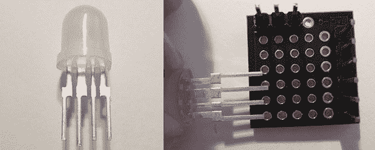

# 可电路板化的 WS2812 LEDs

> 原文：<https://hackaday.com/2014/02/22/breadboardable-ws2812-leds/>

Hackaday 看到了大量以 WS2812 系列数控 RGB LED 为特色的项目，包括裸芯片、RGB LED 灯条或 Adafruit 的新像素。所有这些 WS2812 LED 产品都有一个共同点——它们是芯片 LED，这使得一些项目难以实现。现在，WS2812 家族有了一名新成员—[通孔 LED 版本](http://cpldcpu.wordpress.com/2014/02/18/new-member-of-the-ws2812-family/)——今年晚些时候应该可以通过常见渠道获得。

这些 led 与普通 WS2812 LEDs 的主要区别在于包装；这些是 8 毫米 led，带有电源、接地、数据输入和数据输出引脚。使用预先存在的库，这个 8 毫米 LED 应该与任何其他 WS2812 LED 一样工作。

除了通孔封装，这些新的 led 非常分散，不像普通的芯片 led 那样刺眼。如果你想买几个这样的发光二极管，[这里有卖](http://solderingsunday.com/shop/components/pixelbits-bakers-dozen/)，13 个发光二极管，售价 15 美元。RGB LED 立方体有很大的潜力，这是我们希望尽快看到的。