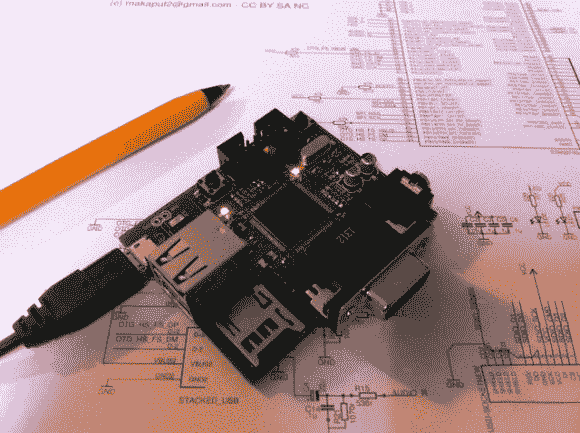

# BitBox 控制台得到升级

> 原文：<https://hackaday.com/2014/02/23/the-bitbox-console-gets-upgraded/>

在过去的几个月里，开源游戏控制台 Bitbox[收到了许多更新](http://bitboxconsole.blogspot.fr/ "BitBox Console")。[上一次我们报道这个 DIY 控制台](http://hackaday.com/2013/09/18/the-bitbox-console-an-open-source-gaming-rig/ "The Bitbox Console: an Open Source Gaming Rig")，【马卡普夫】刚刚获得了运行一个简单游戏的第一个版本。第二个版本将把颜色增加到 32k，增加另一个立体声声道，将控制器从 PS2 切换到 USB，并增加对 [Olimex 的 UEXT 扩展设备](https://www.olimex.com/Products/Modules/)的支持。

虽然硬件升级令人印象深刻，但在 Bitbox 软件上也做了很多工作。一个名为 [Fire](http://bitboxconsole.blogspot.fr/2014/01/new-game-published-fire.html) 的新游戏演示是作为一套教程创建的，以帮助人们开始为游戏机开发。还有一个 [BitBoy](http://bitboxconsole.blogspot.fr/2014/01/bitboy-bitbox-emulator-for-bitbox.html) ，一个用于 Bitbox 的 GameBoy 模拟器。BitBoy 是为 Bitbox 提供动力的 ARM Cortex-M4 处理器的 [gnuboy](http://code.google.com/p/gnuboy/) 的移植版本。它成功地模仿了许多商业游戏。

我们期待看到 Bitbox 的下一步。休息之后，看看 BitBoy 在 Bitbox 上运行的视频。

[https://www.youtube.com/embed/F5noaJ-awRM?version=3&rel=1&showsearch=0&showinfo=1&iv_load_policy=1&fs=1&hl=en-US&autohide=2&wmode=transparent](https://www.youtube.com/embed/F5noaJ-awRM?version=3&rel=1&showsearch=0&showinfo=1&iv_load_policy=1&fs=1&hl=en-US&autohide=2&wmode=transparent)